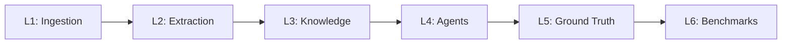

# Fabric 4L

> **Enterprise agentic SaaS platform that transforms unstructured data into structured knowledge through ontology-guided AI pipelines.**

Six-layer architecture — from ingestion to benchmarks — built for teams that need to turn documents, transcripts, and unstructured sources into queryable, verifiable knowledge graphs at production scale.

---

<p align="center">
  <a href="https://github.com/bmsull560/Fabric_4L/actions/workflows/pr-checks.yml">
    
  </a>
  <a href="https://codecov.io/gh/bmsull560/Fabric_4L">
    
  </a>
  
  
  <a href="https://github.com/bmsull560/Fabric_4L/blob/main/LICENSE">
    
  </a>
  <a href="https://github.com/bmsull560/Fabric_4L/releases">
    
  </a>
</p>

---

## Quickstart

The canonical command references are [docs/development/BUILD_SYSTEM.md](docs/development/BUILD_SYSTEM.md), [docs/development/COMMANDS.md](docs/development/COMMANDS.md), [docs/development/DISCOVERY_MAP.md](docs/development/DISCOVERY_MAP.md), and [AGENTS.md](AGENTS.md). Use those files as the source of truth when local setup, Makefile targets, or contributor-agent workflows drift.

Prerequisites: Python 3.11+, Node.js 22.x with pnpm 10.18.1 via Corepack, Docker with Docker Compose, `make`, and the Infisical CLI if you want the recommended generated environment file.

```bash
git clone https://github.com/bmsull560/Fabric_4L.git
cd Fabric_4L
corepack enable
corepack prepare pnpm@10.18.1 --activate
pnpm install --frozen-lockfile
make setup
pnpm env:dev && docker compose -f infra/compose/docker-compose.dev.yml --env-file .env.generated up -d
make migrate
make verify
```

`make setup` installs Python service development dependencies into the pytest Python environment; it does not install frontend dependencies, start Docker infrastructure, or apply migrations. Start the dev stack and run `make migrate` separately before using commands that require live services. If you do not have Infisical access, follow the environment guidance in [AGENTS.md](AGENTS.md) and use the legacy `.env` flow instead of `pnpm env:dev`.

> **New contributor?** See the [GitHub Codespaces guide](codespaces.md) for a one-click dev environment.

---

## Architecture

Fabric 4L processes unstructured data through six specialized layers. Each layer is a horizontally scalable service with its own API, storage, and deployment configuration.



| Layer | Purpose | Key Tech |
|-------|---------|----------|
| **L1: Ingestion** | Multi-format document intake, parsing, and chunking | Python, FastAPI, Redis queues |
| **L2: Extraction** | Entity, relationship, and ontology extraction from chunks | LangGraph pipelines, LLM orchestration |
| **L3: Knowledge** | Knowledge graph construction, deduplication, and persistence | Neo4j, Cypher, graph embeddings |
| **L4: Agents** | Autonomous reasoning agents that operate over the knowledge graph | LangGraph, tool-calling, multi-agent |
| **L5: Ground Truth** | Human-in-the-loop validation, feedback collection, and corrections | PostgreSQL RLS, review workflows |
| **L6: Benchmarks** | Performance measurement, regression detection, and reporting | Prometheus, Grafana, custom metrics |

---

## Tech Stack

| Category | Technology |
|----------|------------|
| **Backend** | Python 3.11, FastAPI, Pydantic v2, SQLAlchemy 2.0 |
| **Frontend** | React 18, Vite, TypeScript, Tailwind CSS, shadcn/ui |
| **Graph Database** | Neo4j 5.x with Cypher |
| **Relational Database** | PostgreSQL 15 with Row-Level Security |
| **Cache & Queues** | Redis 7 |
| **AI / ML** | LangGraph, OpenAI/Anthropic models, sentence-transformers |
| **Orchestration** | Kubernetes, Helm |
| **Observability** | Prometheus, Grafana, structured logging |
| **DevOps** | Docker, GitHub Actions, Makefile-driven workflows |

---

## Enterprise Readiness

- **Multi-tenant** — Tenant isolation enforced at the PostgreSQL RLS layer, with schema-per-tenant support
- **SOC 2 Prep** — Controls documented in `compliance/`, audit trails on all data mutations
- **Kubernetes-native** — Helm charts, HPA, PDBs, and health checks in `k8s/`
- **Contract-governed** — Layer-to-layer contracts defined, versioned, and tested via `make contract-tests`

---

## Project Stats

| Metric | Value |
|--------|-------|
| Contributors | 8 |
| Commits | 3,095 |
| Languages | Python 75.2%, TypeScript 21.5%, Other 3.3% |
| Container Images | 7 |
| Latest Release | v1.2.0 |

---

## Directory Structure

```
Fabric_4L/
├── apps/
│   └── web/                    # React frontend (Vite + TypeScript)
├── services/
│   ├── layer1-ingestion/       # L1: Document intake & parsing
│   ├── layer2-extraction/      # L2: Entity & relationship extraction
│   ├── layer3-knowledge/       # L3: Knowledge graph construction
│   ├── layer4-agents/          # L4: Autonomous agent runtime
│   ├── layer5-ground-truth/    # L5: Human validation workflows
│   └── layer6-benchmarks/      # L6: Performance & regression testing
├── packages/
│   ├── shared-models/          # Pydantic models shared across layers
│   ├── shared-config/          # Configuration schemas and loaders
│   └── shared-testing/         # Test fixtures, factories, utilities
├── docs/                       # Architecture docs, runbooks, ADRs
├── k8s/                        # Helm charts and Kubernetes manifests
├── monitoring/                 # Prometheus rules, Grafana dashboards, alerts
├── compliance/                 # SOC 2 controls, audit logs, policies
├── infra/                      # Docker Compose, Terraform, networking
├── .devcontainer/              # VS Code dev container config
└── Makefile                    # Primary interface: make verify, make test, etc.
```

---

## Development

### Prerequisites

- Docker & Docker Compose
- Python 3.11+
- Node.js 22+
- Make

### Common Commands

| Command | What it does |
|---------|--------------|
| `make setup` | Install deps, start dev services, apply migrations |
| `make verify` | Run full validation (tests + lint + typecheck + contracts) |
| `make test` | Run unit and integration tests |
| `make contract-tests` | Validate layer-to-layer API contracts |
| `make migrate` | Apply database migrations |
| `make lint` | Run ruff (Python) and eslint (TypeScript) |
| `make typecheck` | Run mypy and tsc |
| `make production-readiness-gate` | Full production gate — CI runs this on every PR |

### Dev Container / Codespaces

Open this repo in [GitHub Codespaces](https://codespaces.new/bmsull560/Fabric_4L) for a fully configured environment. The dev container installs all dependencies, starts PostgreSQL/Neo4j/Redis, and runs migrations automatically. See [codespaces.md](codespaces.md) for details.

---

## License & Governance

- **License:** [MIT](LICENSE)
- **Contributing:** See [CONTRIBUTING.md](CONTRIBUTING.md)
- **Security:** See [SECURITY.md](SECURITY.md) for vulnerability reporting
- **Code of Conduct:** See [CODE_OF_CONDUCT.md](CODE_OF_CONDUCT.md)

---

<p align="center">
  Built with care by the <strong>Fabric 4L</strong> team.
</p>
