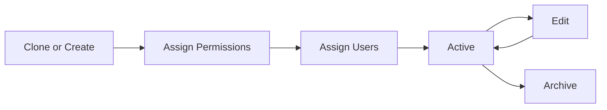

# Role Management

Roles define what users can see and do in ValuePact. Role management lets you create, clone, and customize roles to match your organization's governance structure.

## Who this is for

Admin
Executive

## Prerequisites

- Super Admin or Tenant Admin role
- Review of [User Management](../user-management/index.md)
- Understanding of [Permissions](../user-management/permissions.md)

## Default roles

ValuePact ships with a set of default roles. You can clone and modify them, but you cannot delete the originals.

| Role | Purpose |
|------|---------|
| Super Admin | Full platform control across all tenants |
| Tenant Admin | Full control within a single tenant |
| Content Admin | Governance, configuration, and content |
| Analyst | Creates and edits value initiatives |
| Editor | Views and edits selected data surfaces |
| Viewer | Read-only access to assigned records |

## Role lifecycle

## What you can do

| Action | Description | Path |
|--------|-------------|------|
| Create role | Build a custom role from scratch | **Role Management** > **New Role** |
| Clone role | Duplicate an existing role as a starting point | **Role Management** > **Clone** |
| Assign permissions | Grant granular access | **Role Management** > **Permissions** |
| Assign users | Link users to the role | **User Management** > **Users** |

## Step-by-step: open role management

1. Navigate to **Admin** > **Role Management**.
2. View the list of default and custom roles.
3. Click a role to see its permission summary.
4. Click **Edit** to modify a custom role.

!!! warning "Default role protection"
    Default roles cannot be edited directly. Clone them to create a customized version.

## Permissions required

| Role | Permission | Scope |
|------|-----------|-------|
| Super Admin | Create, edit, delete roles | Organization |
| Tenant Admin | Create, edit, delete roles | Organization |
| Content Admin | View role definitions | Organization |
| Analyst | View own roles | Own user |
| Viewer | View own roles | Own user |

## Limits and guardrails

Limit Maximum 100 custom roles per tenant.

Limit A role name must be unique and between 2 and 50 characters.

Limit Changes to role permissions take effect within 60 seconds.

## Troubleshooting

??? question "Issue: users not seeing updated permissions"
    **Cause:** The role was saved but the identity cache has not refreshed.
    **Resolution:** Ask the user to log out and log back in. Wait up to 60 seconds for the cache to invalidate.

??? question "Issue: cannot delete a custom role"
    **Cause:** The role is still assigned to active users.
    **Resolution:** Reassign all users to another role before deleting.

## Related pages

- [Role Creation](role-creation.md)
- [Permission Assignment](permission-assignment.md)
- [User Management](../user-management/index.md)
- [Permissions](../user-management/permissions.md)

## Escalation path

For role corruption or permission escalation issues:

1. Check the audit log for recent role changes.
2. Revert the role to its last known good version if available.
3. File a support ticket with severity **High**.
4. Escalate to `#valuepact-ops` if unauthorized access is suspected.
