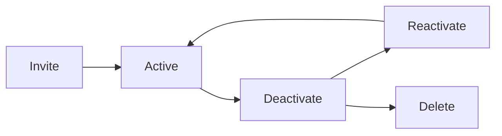

# User Management

User management covers the full lifecycle of platform users: inviting, grouping, permissions, and removal. Proper user management ensures the right people have the right access at the right time.

## Who this is for

Admin
Executive

## Prerequisites

- Tenant Admin or Super Admin role
- Review of [Administration overview](../index.md)
- Verified organization email domain (for SSO auto-provisioning)

## User lifecycle

## What you can do

| Action | Description | Path |
|--------|-------------|------|
| Invite users | Send email invites or bulk import | **User Management** > **Invite Users** |
| Remove users | Deactivate or delete accounts | **User Management** > **Remove Users** |
| Manage permissions | Review and adjust access levels | **User Management** > **Permissions** |
| Manage groups | Create groups and assign members | **User Management** > **Groups** |

## Identity and access principles

ValuePact follows tenant-scoped access. Every user belongs to exactly one tenant. Cross-tenant access is not permitted.

- Users authenticate via email and password, SSO, or API keys.
- Roles determine what a user can see and do.
- Groups simplify bulk permission assignment.
- Deactivation preserves audit history. Deletion is irreversible.

## User status meanings

| Status | Meaning | Can log in |
|--------|---------|------------|
| Invited | Invite sent but not accepted | No |
| Active | Fully operational | Yes |
| Deactivated | Suspended, history preserved | No |
| Deleted | Removed, history anonymized | No |

## Step-by-step: open user management

1. Navigate to **Admin** > **User Management**.
2. Select a tab: **Users**, **Groups**, or **Permissions**.
3. Use the search bar to find a specific user.
4. Click a user row to open the detail panel.

## Permissions required

| Role | Permission | Scope |
|------|-----------|-------|
| Super Admin | Invite, deactivate, delete users | Organization |
| Tenant Admin | Invite, deactivate, delete users | Organization |
| Content Admin | View user list and group membership | Organization |
| Analyst | View users in assigned initiatives | Assigned initiatives |
| Viewer | View limited user profiles | Assigned records |

## Limits and guardrails

Limit Maximum 5,000 active users per tenant. Contact support to increase the limit.

Limit Bulk imports support up to 500 users per CSV file.

Limit Deactivated users do not count toward active user limits.

## Troubleshooting

??? question "Issue: invited user did not receive email"
    **Cause:** Email filtering, incorrect address, or notification channel misconfiguration.
    **Resolution:** Verify the email address in **User Management** > **Users**. Ask the user to check spam folders. Confirm **Configuration** > **Notifications** > **Email** is enabled.

??? question "Issue: user cannot log in after invitation"
    **Cause:** The invite expired, or SSO is required and not configured for the user.
    **Resolution:** Resend the invitation. If SSO is enforced, verify the user domain is under **Security** > **SSO**.

??? question "Issue: group membership not syncing from SSO"
    **Cause:** SCIM group mapping is misconfigured or the group name does not match.
    **Resolution:** Verify the group mapping in **Security** > **SSO** > **SCIM**. Ensure names match exactly, including case.

## Related pages

- [Invite Users](invite-users.md)
- [Remove Users](remove-users.md)
- [Permissions](permissions.md)
- [Groups](groups.md)
- [Role Management](../role-management/index.md)

## Escalation path

For bulk user import failures or tenant lockout:

1. Check the import error log in **User Management** > **Import History**.
2. Fix the CSV formatting and retry.
3. File a support ticket with the failed CSV and error message.
4. Escalate to `#valuepact-ops` if more than 10% of users are affected.
