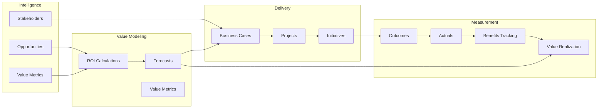

# Core Concepts

ValuePact is built around twelve interconnected concepts that form a complete value realization system. This section explains each concept and how they work together to turn raw intelligence into board-ready outcomes.

## Who this is for

End User
Admin
Executive

## Concept map

The diagram below shows how concepts flow from intelligence through delivery and measurement.

## The twelve concepts

| Concept | What it is | Why it matters |
|---------|-----------|---------------|
| [Value Realization](value-realization.md) | The full lifecycle from signal to realized outcome | Ensures promised value becomes measurable results |
| [Business Cases](business-cases.md) | Packaged, defensible value arguments produced as deliverables | Gives CFOs and executives evidence-backed documents |
| [ROI Calculations](roi-calculations.md) | Calculator-driven return analysis built on drivers and formulas | Quantifies value in credible, auditable terms |
| [Benefits Tracking](benefits-tracking.md) | Monitoring expected versus achieved benefits | Surfaces variance and keeps execution accountable |
| [Stakeholders](stakeholders.md) | People and roles mapped during discovery | Personalizes messaging and aligns decision makers |
| [Opportunities](opportunities.md) | Potential value-creating situations identified during intelligence | Prioritizes where to invest time and effort |
| [Projects](projects.md) | Execution containers with timelines and resources | Turns value models into funded, tracked work |
| [Initiatives](initiatives.md) | Strategic programs that group projects and outcomes | Provides portfolio-level visibility and rollup |
| [Value Metrics](value-metrics.md) | Measurable indicators of value (KPIs) | Defines what "good" looks like in numbers |
| [Outcomes](outcomes.md) | Concrete results achieved | Proves value was delivered, not just projected |
| [Forecasts](forecasts.md) | Predicted future value | Sets expectations across scenarios |
| [Actuals](actuals.md) | Realized historical value | Grounds forecasts in real data |

## Navigation tips

Each concept page follows the same structure:

1. **Overview** — what the concept means and why it matters
2. **How it works** — mechanics, workflows, and definitions
3. **Examples** — real-world scenarios with sample data
4. **Permissions** — who can do what
5. **Limits** — guardrails and constraints
6. **Troubleshooting** — common issues and resolutions

Use the concept map above to jump between related topics. Cross-links on every page connect forward and backward through the value lifecycle.

!!! tip "Start here"
    If you are new to ValuePact, begin with [Value Realization](value-realization.md) for the big picture, then read [Opportunities](opportunities.md) and [ROI Calculations](roi-calculations.md) to understand how value is discovered and quantified.

## How the concepts fit together

1. **Intelligence phase.** You capture [opportunities](opportunities.md), identify [value drivers](roi-calculations.md), attach evidence, and map [stakeholders](stakeholders.md).
2. **Value modeling phase.** Drivers and formulas feed [ROI calculations](roi-calculations.md) and a value model, which produces [forecasts](forecasts.md) across conservative, expected, and optimistic scenarios.
3. **Delivery phase.** The model becomes a [business case](business-cases.md) with CFO, executive, and technical views. Approved business cases spawn [projects](projects.md), which roll up into [initiatives](initiatives.md).
4. **Measurement phase.** [Outcomes](outcomes.md) are tracked against [value metrics](value-metrics.md). [Actuals](actuals.md) are ingested and reconciled against [forecasts](forecasts.md). [Benefits tracking](benefits-tracking.md) compares expected versus achieved, and [value realization](value-realization.md) closes the loop.

## Concept maturity

Not every account uses all twelve concepts on day one. Typical maturity progression:

| Maturity level | Concepts active | Typical user |
|----------------|-----------------|-------------|
| Level 1: Discovery | Opportunities, Stakeholders, Value Metrics | Sales development |
| Level 2: Modeling | ROI Calculations, Forecasts, Value Metrics | Value consultant |
| Level 3: Delivery | Business Cases, Projects, Initiatives | Account executive |
| Level 4: Measurement | Outcomes, Actuals, Benefits Tracking, Value Realization | Customer success |

Admins can enforce minimum maturity requirements per account stage in **Administration > Configuration > Maturity Gates**.

## Concept relationships

Understanding how concepts relate prevents drift between value models and execution:

- **Opportunities drive ROI calculations.** Without qualified opportunities, driver trees lack anchors.
- **ROI calculations generate forecasts.** Formulas and scenarios produce the numbers that set expectations.
- **Forecasts become business cases.** Packaged narratives turn projections into approvable documents.
- **Business cases authorize projects.** Approved value arguments unlock funding and resources.
- **Projects produce outcomes.** Execution delivers the measurable results that validate the model.
- **Outcomes feed actuals.** Realized values are reconciled against forecasts to compute realization.
- **Initiatives provide the lens.** Strategic groupings help executives see patterns across accounts.
- **Stakeholders provide the context.** Every concept is interpreted differently by each role; mapping ensures the right message reaches the right person.

## Frequently asked questions

**Do I need to use all twelve concepts for every account?**
No. Small accounts may stop at business cases. Enterprise accounts typically use the full stack through outcomes and actuals.

**Who owns the data for each concept?**
Sales owns opportunities and stakeholders. Value engineering owns ROI calculations and forecasts. Customer success owns outcomes and actuals. Admins configure metrics, initiatives, and workflows.

**Can I customize the concept names for my organization?**
Concept names are fixed to preserve cross-tenant analytics and benchmark alignment. You can customize value pack terminology (drivers, personas, use cases) in **Administration > Value Packs**.

## Prerequisites

- A ValuePact workspace with at least one account
- Completion of the [Quick Start Guide](../getting-started/quick-start-guide.md)
- Understanding of your organization's value pack (industry ontology)

## Related pages

- [Getting Started](../getting-started/index.md)
- [User Guides](../end-user-guides/index.md)
- [Analytics](../analytics/index.md)
- [Workflow Management](../workflow-management/index.md)

## Escalation path

If a concept is unclear or missing from your workspace, contact your workspace admin. For platform-level questions, open a support ticket via the Help Center.