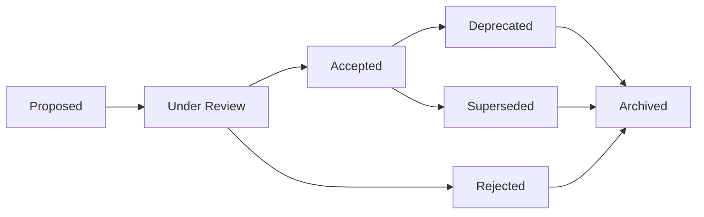

# Architecture Decision Records (ADRs)

This section indexes the Architecture Decision Records (ADRs) that govern major technical choices in the ValuePact platform. ADRs are preserved in the repository at `docs/explanations/adr/`.

!!! note "ADR Format"
    Each ADR follows a standard format: Context, Decision, Consequences, and Status. ADRs are immutable once accepted; new information is captured in a follow-up ADR rather than editing the original.

## Active ADRs

| ADR | Title | Status | Layer |
|-----|-------|--------|-------|
| ADR-001 | Fabric Harness as the Governed Execution Spine for Agentic Value Workflows | Accepted | L4 |
| ADR-002 | Six-Layer Architecture | Accepted | All |
| ADR-003 | Neo4j + pgvector Hybrid Graph Database | Accepted | L3 |
| ADR-004 | JWT + API Key Authentication Strategy | Accepted | API |
| ADR-005 | Ontology-Guided LLM Extraction | Accepted | L2 |
| ADR-006 | LangGraph for Agent Orchestration | Accepted | L4 |
| ADR-007 | OpenAPI TypeScript Generator Selection | Accepted | Frontend |
| ADR-008 | OpenTelemetry for Observability | Accepted | All |
| ADR-009 | JWT + API Key Hybrid Authentication | Superseded by ADR-004 | API |
| ADR-010 | PostgreSQL RLS for Multi-Tenancy | Accepted | All |
| ADR-011 | LangGraph for Workflow Orchestration | Accepted | L4 |
| ADR-012 | Circuit Breaker Pattern for External Service Resilience | Accepted | All |
| ADR-013 | Repository Pattern for Data Access | Accepted | All |
| ADR-014 | Multi-Layer Architecture vs Monolith | Accepted | All |
| ADR-015 | OpenTelemetry for Observability (v2) | Accepted | All |
| ADR-016 | Neo4j for Knowledge Graph Storage | Accepted | L3 |
| ADR-017 | JWT + API Key Hybrid Authentication (v2) | Accepted | API |
| ADR-018 | Layer 5 Canonical Source | Accepted | L5 |
| ADR-019 | Replayability, Event Envelope, and Layer 4 Replay Harness | Accepted | L4 |
| ADR-020 | Layer 2-5 Signal Refinery | Accepted | L2, L5 |

## Reading ADRs

ADRs are stored in the repository at:

```
docs/explanations/adr/
```

Each filename follows the pattern:

```
ADR-NNN-short-description.md
```

## ADR Lifecycle



### Status Definitions

| Status | Meaning |
|--------|---------|
| **Proposed** | Under initial discussion, not yet reviewed |
| **Under Review** | Undergoing structured review by stakeholders |
| **Accepted** | Approved and governing current implementation |
| **Rejected** | Explicitly declined, with rationale preserved |
| **Deprecated** | No longer recommended, but not yet replaced |
| **Superseded** | Replaced by a newer ADR; see the successor for current guidance |
| **Archived** | Retained for historical context only |

## When to Write an ADR

Create a new ADR when:

- Introducing a new technology or dependency
- Changing a layer boundary or service responsibility
- Modifying the authentication or tenancy model
- Adding a new database or changing persistence strategy
- Changing the observability or deployment architecture
- Any decision with cross-team or long-term maintenance implications

## Proposing a New ADR

1. Copy `docs/explanations/adr/ADR-002-six-layer-architecture.md` as a template
2. Assign the next available sequential number
3. Fill in Context, Decision, Consequences, and Status
4. Open a PR with the `architecture` label
5. Request review from the platform team and affected layer owners

## Related

- [System Overview](../architecture/system-overview.md) — How ADRs shape the six-layer architecture
- [Architecture section](../architecture/index.md) — Current implementation of accepted ADRs
- `docs/explanations/adr/` — Source-of-truth ADR files in the repository
