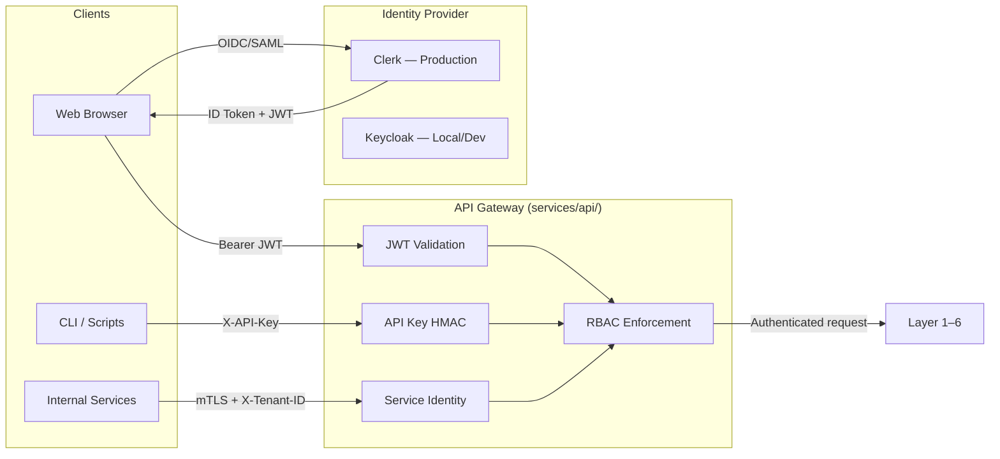

# Authentication

Fabric4L uses an OIDC-compliant identity provider for production authentication and Keycloak for local development. This page describes the auth architecture, RBAC model, request context propagation, and the strict governance around development bypass flags.

<span class="vp-badge vp-badge--role">Developer</span>
<span class="vp-badge vp-badge--role">Admin</span>

## Authentication architecture



### Production: Clerk

The production IdP is Clerk. It provides standard OIDC discovery and organization-aware JWT templates.

| Environment variable | Purpose |
|----------------------|---------|
| `CLERK_PUBLISHABLE_KEY` | Frontend key (`pk_test_` or `pk_live_`) |
| `CLERK_SECRET_KEY` | Backend key (`sk_test_` or `sk_live_`) |
| `CLERK_JWT_ISSUER` | Issuer URL (e.g., `https://clerk.your-domain.com`) |
| `CLERK_JWT_AUDIENCE` | Clerk application ID |
| `CLERK_JWKS_URL` | JWKS endpoint for RS256 validation |

JWT validation middleware:
1. Fetches JWKS from the discovery endpoint
2. Validates RS256 signature using Clerk public keys
3. Verifies issuer and audience claims
4. Extracts `tenant_id`, `roles`, and `permissions`

### Development: Keycloak

Keycloak is used for local development and integration testing only.

| Environment variable | Default |
|----------------------|---------|
| `KEYCLOAK_URL` | `http://localhost:8080` |
| `KEYCLOAK_REALM` | `fabric` |

!!! warning "Keycloak is dev-only"
    The Keycloak deployment in `k8s/dev-only/keycloak-deployment.yaml` must not be used in production. Production environments must use Clerk or another managed OIDC provider.

## RBAC model

Roles are derived from the IdP organization membership and mapped to permissions inside the platform.

| Claim | Source | Usage |
|-------|--------|-------|
| `sub` | IdP | User ID |
| `tenant_id` | IdP organization | Tenant isolation scope |
| `roles` | IdP organization role | `org:admin`, `org:member` |
| `permissions` | Derived from roles | Granular action permissions |

The `GovernanceMiddleware` in `packages/shared/src/value_fabric/shared/identity/middleware.py` resolves identity in priority order:

1. `Bearer` JWT from `Authorization` header
2. `X-API-Key` for service integrations
3. `X-Tenant-ID` with internal IP allowlist for service-to-service calls

## Request context propagation

Once authenticated, the middleware sets an immutable `RequestContext` object:

```python
from value_fabric.shared.identity.dependencies import get_request_context
from value_fabric.shared.identity.context import RequestContext

@router.get("/items")
async def list_items(ctx: RequestContext = Depends(get_request_context)):
    tenant_id = ctx.tenant_id  # Guaranteed to be set
    ...
```

The context is propagated across async boundaries via AsyncLocalStorage (or language-equivalent) and across services via the `x-fabric-tenant-id` header.

## Service-to-service auth

Internal layer-to-layer calls use mTLS plus the `X-Tenant-ID` header with IP allowlist validation. This avoids repeated JWT validation overhead while maintaining tenant scoping.

| Pattern | Use case |
|---------|----------|
| JWT (Bearer) | Browser → API, human users |
| API Key (HMAC) | CLI, scripts, third-party integrations |
| mTLS + `X-Tenant-ID` | L1 → L2 → L3 internal calls |

## Dev auth bypass flags

The following environment variables exist **only** for local development and automated testing. They must never be set in staging, production, or any production-like environment.

| Flag | Behavior if enabled |
|------|---------------------|
| `DEV_AUTH_BYPASS=true` | Skips JWT validation |
| `ALLOW_DEV_AUTH_BYPASS=true` | Permits bypass logic to run |
| `AUTH_BYPASS_ENABLED=true` | Alias for bypass enablement |
| `ALLOW_INSECURE_DEV_AUTH_BYPASS=true` | Overrides safety checks |

!!! danger "Production safety validator"
    `ProductionSafetyValidator` scans for these flags at startup. If any are set in a production-like environment, the service fails to boot. The frontend also runs `test:prod-auth-bypass` to assert that production builds do not contain bypass code paths.

## Validation

```bash
# Run auth readiness gate
make gate-auth-readiness

# Run security tests including auth boundaries
make security-test

# Run frontend auth bypass check
pnpm --dir apps/web run test:prod-auth-bypass

# Validate Keycloak realm seed security
make check-keycloak-realm-seed-security
```

## Related pages

- [Tenancy](./tenancy.md) — How tenant_id is enforced after authentication
- [Observability](./observability.md) — Audit events for auth decisions
- `docs/explanations/adr/ADR-004-jwt-api-key-authentication-strategy.md`
- `docs/explanations/adr/ADR-009-jwt-api-key-hybrid-authentication.md`
