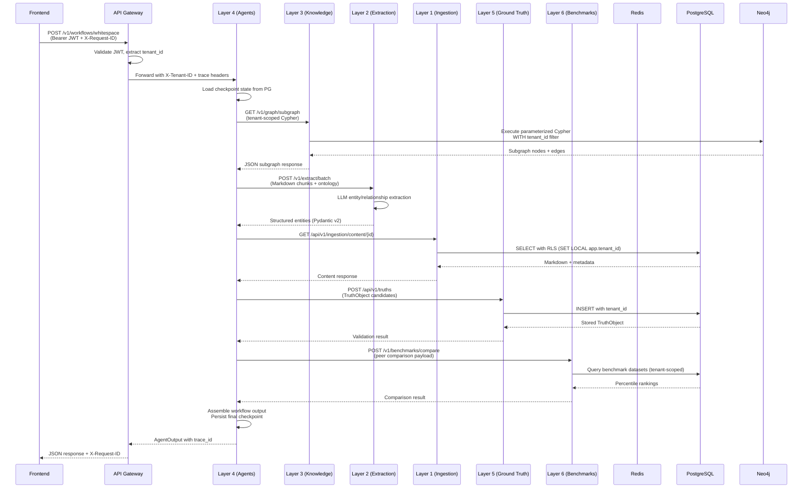

# Data Flow

This page describes how data moves through the six-layer pipeline, how tenant context propagates across asynchronous boundaries, and where state is stored at each stage.

<span class="vp-badge vp-badge--role">Developer</span>

## End-to-end request flow

The following sequence shows a typical agent workflow request that touches all layers, from ingestion through benchmarking.



## Tenant context propagation

Tenant context is established at the authentication boundary and propagated automatically. It is never derived from request body parameters.

| Boundary | Propagation mechanism |
|----------|----------------------|
| HTTP gateway → Layer | `x-fabric-tenant-id` header with signature context |
| Layer → Database | `SET LOCAL app.tenant_id` at transaction start |
| Layer → Celery task | Explicit `tenant_id` field in every message payload |
| Layer → Neo4j | Parameterized Cypher with `tenant_id` property filters |

!!! warning "Do not trust request body tenant IDs"
    The preferred pattern is `tenant_id = ctx.tenant_id` from authenticated context. Reading `tenant_id` from `request.json()` without validating it against the authenticated context is a security anti-pattern.

## Queue patterns

Layer 1 and Layer 2 use Celery with Redis as the broker and result backend.

| Queue | Purpose | Retry policy |
|-------|---------|--------------|
| `ingestion.crawl` | Playwright crawl jobs | Exponential backoff, max 3 retries |
| `ingestion.post_process` | Markdown normalization | Linear backoff, max 5 retries |
| `extraction.batch` | LLM batch extraction | Exponential backoff, max 3 retries |
| `extraction.ingest` | RDF push to Layer 3 | Immediate retry, max 5 retries |

Celery workers run in separate containers and scale horizontally. Task payloads include `tenant_id` so background work remains tenant-scoped even outside the HTTP request lifecycle.

## Database per layer

| Layer | Primary store | Role |
|-------|---------------|------|
| Layer 1 | PostgreSQL | Job state, source registry, compliance audit log |
| Layer 2 | PostgreSQL | Extraction jobs, provenance records |
| Layer 3 | Neo4j + pgvector | Graph nodes/relationships + vector embeddings |
| Layer 4 | PostgreSQL | Workflow checkpoints, agent state |
| Layer 5 | PostgreSQL | TruthObjects, evidence sources, maturity history |
| Layer 6 | PostgreSQL | Benchmark datasets, comparison results |

!!! note "No cross-layer transactions"
    Cross-layer consistency is achieved through sagas and idempotent retries, not distributed transactions. Each layer owns its own database and commits independently.

## Caching strategy

| Cache | Technology | TTL | Use case |
|-------|------------|-----|----------|
| In-memory | Python `functools.lru_cache` | Request-scoped | Ontology model definitions |
| Distributed | Redis | 5 minutes | JWT JWKS keys, tenant metadata |
| Distributed | Redis | 24 hours | robots.txt compliance cache (Layer 1) |
| Query | Neo4j query plan cache | Automatic | Repeated Cypher patterns |

The frontend uses TanStack Query for server-state caching with stale-while-revalidate behavior.

## Data formats between layers

| From | To | Format | Content |
|------|-----|--------|---------|
| L1 | L2 | Markdown chunks | Normalized text with metadata headers |
| L2 | L3 | RDF/Turtle (TTL) | Entities, relationships, and PROV-O provenance |
| L3 | L4 | JSON subgraph | Nodes, edges, embeddings, and citations |
| L4 | L5 | JSON TruthObject candidates | Claims with confidence scores and source links |
| L4 | L6 | JSON benchmark payload | Value metrics for peer comparison |
| L5 | L3 | Cypher MERGE | `:GroundTruth` nodes synced to Neo4j |

## Validation

```bash
# Run queue topology tests
pytest tests/integration/test_celery_queue_topology.py -m celery

# Run tenant isolation tests across data flows
pytest tests/security/test_hostile_tenant_e2e_matrix.py -v

# Run backend-integrated validation (requires live stack)
make test-backend-integrated-validation
```

## Related pages

- [System Overview](./system-overview.md) — Layer responsibilities and deployment topology
- [Tenancy](./tenancy.md) — Isolation strategy for PostgreSQL and Neo4j
- [Observability](./observability.md) — Tracing requests across layers
