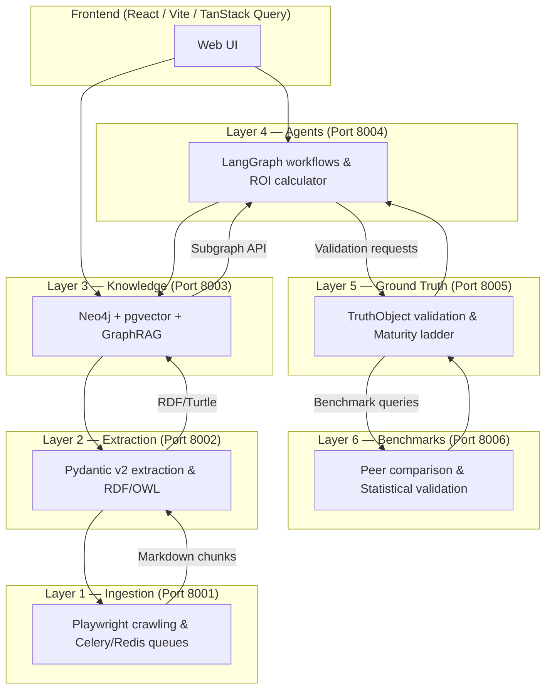

# Architecture

The Fabric4L Architecture section is the engineering source of truth for ValuePact's six-layer platform. It describes how ingestion, extraction, knowledge graph, agentic workflows, ground truth, and benchmarks fit together into a production-grade, multi-tenant system.

<span class="vp-badge vp-badge--role">Developer</span>
<span class="vp-badge vp-badge--role">Admin</span>

## Architecture at a glance



## What you will find here

| Page | Purpose |
|------|---------|
| [System Overview](./system-overview.md) | Six-layer pipeline, technology stack, deployment topology, and canonical architecture diagram |
| [Service Map](./service-map.md) | Port assignments, service responsibilities, API gateway pattern, and shared packages |
| [Data Flow](./data-flow.md) | End-to-end data flow, tenant context propagation, queue patterns, and caching strategy |
| [Authentication](./auth.md) | Auth architecture, RBAC, dev auth bypass governance, and service-to-service identity |
| [Tenancy](./tenancy.md) | Multi-tenant isolation strategy for PostgreSQL, Neo4j, and application layers |
| [Observability](./observability.md) | Request IDs, structured logging, metrics, audit events, health checks, and runbooks |

## How to use this section

!!! tip "Start with System Overview"
    If you are new to the platform, read [System Overview](./system-overview.md) first. It explains the layer boundaries and deployment topology.

!!! tip "Before writing code"
    If you are about to add or change backend code, read [Service Map](./service-map.md) to confirm the canonical runtime path, then [Tenancy](./tenancy.md) to ensure tenant isolation is preserved.

!!! tip "Before changing auth"
    Any auth-related change must be reviewed against [Authentication](./auth.md) and validated with `make gate-auth-readiness`.

## Source of truth

This section is **authoritative**. All claims are backed by:

- `AGENTS.md` — Concise agent entry point; follow its linked progressive-disclosure guidance
- `docs/contract.md` — Canonical platform contract
- `docs/explanations/adr/ADR-002-six-layer-architecture.md` — Layer boundary decisions
- `docs/reference/layer-runtime-path-governance.md` — Canonical path policy

## Key architectural invariants

| Invariant | Enforcement |
|-----------|-------------|
| Layer boundaries | `make contract-tests` |
| Tenant isolation | `make gate-tenant-isolation` |
| Runtime path parity | `tests/contract/test_layer_runtime_parity.py` |
| Auth bypass absent in production | `ProductionSafetyValidator` at startup |
| OpenAPI drift | `pnpm run check:contract-compliance` |

## Validation

You can verify architecture facts with these commands:

```bash
# Verify all checks pass before changing architecture
make verify

# Run contract tests that assert layer boundaries
make contract-tests

# Validate service entrypoints and runtime parity
pytest tests/contract/test_layer_runtime_parity.py

# Validate architecture conformance
make gate-arch
```

## Related pages

- [Fabric4L Engineering Overview](../index.md)
- [Development Standards](../development/coding-standards.md)
- [Security Overview](../security/index.md)
- [Operations Runbooks](../operations/runbooks.md)
