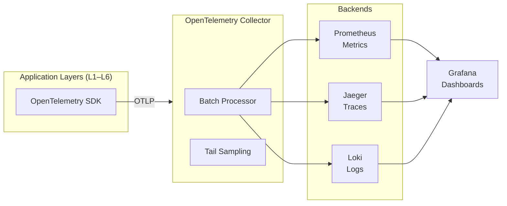

# Observability

Fabric4L uses OpenTelemetry as the unified telemetry layer, backed by Prometheus for metrics, Jaeger for traces, Loki for logs, and Grafana for dashboards. This page describes the observability stack, how to correlate signals, and where to find runbooks for alerts.

<span class="vp-badge vp-badge--role">Developer</span>
<span class="vp-badge vp-badge--role">Admin</span>

## Observability stack



| Signal | Backend | Query language |
|--------|---------|----------------|
| Metrics | Prometheus | PromQL |
| Traces | Jaeger | Jaeger Query |
| Logs | Loki | LogQL |
| Dashboards | Grafana | Visual |

## Request IDs

Every incoming request is assigned a request ID at the gateway. This ID propagates through all downstream calls.

| Header | Purpose |
|--------|---------|
| `X-Request-ID` | Unique request identifier |
| `X-Correlation-ID` | Cross-service correlation |
| `traceparent` | W3C trace context for OpenTelemetry |

```python
# Structured log entry includes trace context
logger.info(
    "Starting workflow",
    extra={
        "trace_id": trace_id,
        "span_id": span_id,
        "tenant_id": str(ctx.tenant_id),
    }
)
```

## Structured logging

Logs are emitted in JSON format with stable fields:

```json
{
  "timestamp": "2026-06-07T19:36:18.334Z",
  "level": "info",
  "message": "Workflow completed",
  "service": "layer4-agents",
  "trace_id": "abc123",
  "span_id": "def456",
  "tenant_id": "tenant-uuid",
  "workflow_id": "wf-123",
  "duration_ms": 1240
}
```

!!! tip "Correlate logs with traces"
    Include `trace_id` and `span_id` in every log entry. In Grafana, click from a metric spike to the matching trace to the matching logs.

## Metrics

Each layer exports Prometheus metrics for health, performance, and business events.

### Layer 1 example metrics

| Metric | Type | Description |
|--------|------|-------------|
| `layer1_stuck_jobs` | Gauge | Jobs in non-terminal states too long |
| `layer1_retry_events_total` | Counter | Celery retry events |
| `layer1_urls_blocked_total` | Counter | Compliance-driven URL blocks |
| `layer1_health_status` | Gauge | `1` healthy, `0` unhealthy |

### Layer 4 example metrics

| Metric | Type | Description |
|--------|------|-------------|
| `layer4_stuck_workflows_total` | Gauge | Workflows stuck in RUNNING or WAITING_FOR_HUMAN |
| `layer4_repeated_workflow_failures_total` | Counter | Repeated failure events |
| `layer4_approval_wait_seconds_bucket` | Histogram | Human approval wait time |
| `layer4_tool_auth_failures_total` | Counter | Tool authorization failures |
| `layer4_checkpoint_corruption_detected_total` | Counter | Checkpoint corruption events |

## Audit events

Audit events are immutable records of security-relevant actions. They are stored separately from application logs and have a longer retention policy.

| Event type | Trigger | Retention |
|------------|---------|-----------|
| `auth_success` / `auth_failure` | Every authentication attempt | 7 years |
| `tenant_context_set` | Tenant resolution | 7 years |
| `privileged_db_session_activated` | Admin bypass of RLS | 7 years |
| `api_key_created` / `api_key_revoked` | API key lifecycle | 7 years |
| `cross_tenant_query_denied` | Tenant isolation block | 7 years |

## Health checks

Every layer exposes standard health endpoints:

| Endpoint | Purpose |
|----------|---------|
| `GET /health` | Liveness — service is running |
| `GET /ready` | Readiness — dependencies (DB, cache) are reachable |
| `GET /health/detailed` | Component-level status for diagnostics |

Example response:

```json
{
  "status": "healthy",
  "components": {
    "database": "up",
    "redis": "up",
    "neo4j": "up"
  }
}
```

## Alerting and runbooks

Prometheus alerts are defined per layer in `monitoring/`.

| Alert file | Layer | Runbook |
|------------|-------|---------|
| `monitoring/layer1-alerts.yml` | Layer 1 | `docs/runbooks/layer1-alerts.md` |
| `monitoring/layer2-alerts.yml` | Layer 2 | `docs/runbooks/layer2-alerts.md` |
| `monitoring/layer4-alerts.yml` | Layer 4 | `docs/runbooks/layer4-alerts.md` |

Critical alerts include:

- `Layer1ComponentUnhealthy` — API, database, or Redis is down
- `Layer4RepeatedFailures` — Workflow failure rate exceeds 0.1 per minute
- `Layer4CheckpointCorruption` — Checkpoint hash mismatch detected
- `Layer4ToolAuthFailures` — Tool authorization failure rate elevated

!!! warning "Every alert must have a runbook"
    All alert definitions include a `runbook_url` annotation. If you add a new alert, you must add or update the corresponding runbook.

## SLOs

| SLO | Metric | Target | Alert threshold |
|-----|--------|--------|-----------------|
| Availability | `up{job="layer4-agents"}` | 99.9% | < 99.9% for 5m |
| Latency p99 | `histogram_quantile(0.99, workflow_duration)` | < 5s | > 5s for 10m |
| Error rate | `rate(workflow_starts{status="error"}[5m])` | < 0.1% | > 0.1% for 5m |
| Saturation | Memory utilization | < 80% | > 80% |

## Validation

```bash
# Run observability tests
pnpm test:observability

# Lint log coverage
pnpm lint:logs

# Check observability readiness
make gate-obs

# Validate runbooks
pnpm ops:runbooks:lint
pnpm ops:incident:check
```

## Related pages

- [System Overview](./system-overview.md) — Deployment topology including monitoring backends
- [Data Flow](./data-flow.md) — Trace propagation across layers
- [Operations Runbooks](../operations/runbooks.md)
- `docs/explanations/adr/ADR-008-opentelemetry-for-observability.md`
