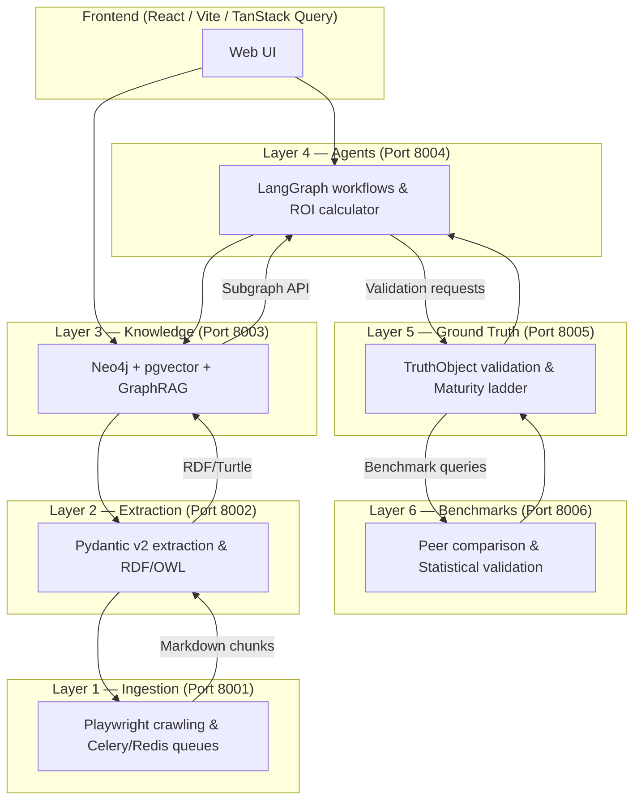

# System Overview

ValuePact is built on a six-layer pipeline architecture. Each layer is an independently deployable service with its own data store, API contract, and scaling profile. Data flows upward from raw ingestion through structured extraction, knowledge graph storage, agentic reasoning, ground truth validation, and continuous benchmarking.

<span class="vp-badge vp-badge--role">Developer</span>
<span class="vp-badge vp-badge--role">Admin</span>

## Six-layer pipeline



## Layer responsibilities

| Layer | Service | Port | Technology | Primary responsibility |
|-------|---------|------|------------|------------------------|
| Layer 1 | `services/layer1-ingestion/` | 8001 | Python, Playwright, Celery, Redis, PostgreSQL | Compliance-aware web crawling and document ingestion |
| Layer 2 | `services/layer2-extraction/` | 8002 | Python, Pydantic v2, LLM APIs | Ontology-guided entity and relationship extraction |
| Layer 3 | `services/layer3-knowledge/` | 8003 | Python, Neo4j, pgvector | Knowledge graph storage, GraphRAG, hybrid retrieval |
| Layer 4 | `services/layer4-agents/` | 8004 | Python, LangGraph, FastAPI | Agentic workflows, ROI calculation, business case generation |
| Layer 5 | `services/layer5-ground-truth/` | 8005 | Python, FastAPI, PostgreSQL | TruthObject validation, evidence-backed claims, maturity ladder |
| Layer 6 | `services/layer6-benchmarks/` | 8006 | Python, FastAPI, PostgreSQL | Peer comparison, statistical validation, benchmark datasets |

!!! note "Layer boundary invariant"
    Do not move logic across layers unless explicitly instructed. Each layer owns its responsibility end-to-end. See `ADR-002` for the decision record.

## Technology stack summary

| Concern | Technology | Rationale |
|---------|------------|-----------|
| Frontend framework | React 18 + TypeScript | Component-driven UI with strict typing |
| Build tool | Vite | Fast dev server and optimized production builds |
| Frontend state | TanStack Query + Zustand | Server state in Query, client state in Zustand |
| UI components | shadcn/ui + Tailwind CSS | Accessible, composable primitives with utility-first styling |
| Backend framework | FastAPI (Python 3.11+) | Async-native, OpenAPI generation, Pydantic integration |
| Graph database | Neo4j | Native graph traversal for relationship-heavy queries |
| Vector store | pgvector (PostgreSQL) | Hybrid vector + relational queries in the same transaction |
| Task queue | Celery + Redis | Async job distribution with visibility and retry semantics |
| Auth/IdP | Clerk (production), Keycloak (local/dev) | OIDC-compliant with tenant-aware JWT claims |
| Secret management | Infisical | Environment-specific secret injection without committing values |

## Deployment topology

### Local development

```bash
# Infisical-assisted (recommended)
pnpm env:dev && docker compose -f docker-compose.dev.yml --env-file .env.generated up -d

# Legacy manual
# cp .env.example .env && docker compose -f docker-compose.dev.yml up -d
```

The local stack boots:

- PostgreSQL (layer state)
- Redis (Celery broker and cache)
- Neo4j (knowledge graph)
- Keycloak (local OIDC provider)
- All six layer services (ports 8001–8006)

### Production

| Component | Pattern |
|-----------|---------|
| Services | Containerized on Kubernetes (`k8s/`) |
| Databases | Managed PostgreSQL with read replicas; Neo4j cluster |
| Cache/Queue | Managed Redis or ElastiCache |
| Secrets | Infisical Kubernetes Operator |
| CI/CD | GitHub Actions with `make production-readiness-gate` as the required gate |

!!! warning "Never deploy dev auth bypass to production"
    The `DEV_AUTH_BYPASS`, `ALLOW_DEV_AUTH_BYPASS`, `AUTH_BYPASS_ENABLED`, and `ALLOW_INSECURE_DEV_AUTH_BYPASS` flags are validated by `ProductionSafetyValidator` and will cause startup failure in production-like environments. See [Authentication](./auth.md) for details.

## Data flow summary

1. **Ingestion (L1)** crawls sources with Playwright, enforces robots.txt compliance, and stores normalized Markdown.
2. **Extraction (L2)** chunks content, runs LLM-guided entity/relationship extraction, and serializes results as RDF/OWL with provenance.
3. **Knowledge (L3)** ingests RDF into Neo4j, builds vector embeddings in pgvector, and serves GraphRAG and subgraph APIs.
4. **Agents (L4)** orchestrate LangGraph workflows that query the knowledge graph, run calculations, generate narratives, and pause for human approval.
5. **Ground Truth (L5)** validates agent outputs as TruthObjects with evidence links and maturity ladder progression.
6. **Benchmarks (L6)** compares claims against peer datasets and provides statistical range validation.

## Validation

```bash
# Boot the full local stack and run smoke tests
make test-backend-integrated-release-smoke

# Run contract tests that assert layer boundaries
make contract-tests

# Validate architecture conformance
make gate-arch
```

## Related pages

- [Service Map](./service-map.md) — Port assignments and canonical paths
- [Data Flow](./data-flow.md) — Sequence diagrams and tenant propagation
- `docs/explanations/adr/ADR-002-six-layer-architecture.md`
