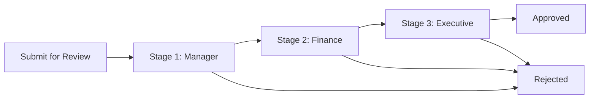

# Approval Workflows

Approval workflows enforce governance by requiring authorized reviewers to sign off before a record advances. You can configure single or multi-stage approvals with role-based gates and delegation.

## Who this is for

Admin
Executive
Analyst

## Prerequisites

- Tenant Admin or Content Admin role
- Defined [roles and permissions](../administration/role-management/index.md)
- Active [status transitions](statuses.md) connecting `in_review` to `approved`

## Approval stages

An approval workflow consists of one or more stages. Each stage has approvers, conditions, and exit rules.

| Property | Description |
|----------|-------------|
| Stage name | Human-readable label, e.g., "Finance Review" |
| Approvers | Users or groups assigned to review |
| Required approvals | Minimum number of approvers who must approve |
| Approval mode | `any_of`, `all_of`, `majority` |
| Condition | Optional field or formula gate to include the stage |
| Timeout | Hours until escalation triggers |

## Configuring approvers

You can assign approvers by:

- **User:** Specific named user.
- **Role:** Any user holding a role, e.g., Tenant Admin.
- **Group:** Members of a defined [group](../administration/user-management/groups.md).
- **Record field:** Dynamic approver drawn from a stakeholder field on the record.

## Multi-stage approval

Stages run in sequence by default. Parallel stages are supported when stages have no interdependencies.

### Step-by-step: create a multi-stage approval

1. Navigate to **Admin** > **Configuration** > **Workflows**.
2. Select the workflow and click **Approval**.
3. Click **Add Stage**.
4. Enter a **Stage Name** and set **Order**.
5. Choose **Approver Type** and select the users, roles, or groups.
6. Set **Required Approvals** and **Approval Mode**.
7. Add a **Condition** if the stage should only appear for certain record types.
8. Click **Save** and **Publish**.

## Delegation

Approvers can delegate their authority when unavailable.

- Delegation is configured in **My Account** > **Delegation**.
- The delegate inherits the approver's permissions for the specified date range.
- Delegation is audited and visible in the approval history.

!!! warning "Delegation limits"
    A user can delegate to one person at a time. Circular delegation is blocked by the system.

## Rejection handling

When a stage is rejected, the record returns to `rejected` status or a configured fallback status.

| Rejection action | Behavior |
|-----------------|----------|
| Return to draft | Owner must revise and resubmit from the beginning |
| Return to previous stage | Record re-enters the prior approval stage |
| Stay in review with comments | Record remains `in_review` for clarification |

You configure the rejection action per stage in the **Approval** tab.

## Approval history

Every approval action is recorded:

- Approver name and role at time of action
- Timestamp and decision (approve, reject, delegate)
- Comments and attachments
- Override indicators

## Permissions required

| Role | Permission | Scope |
|------|-----------|-------|
| Super Admin | Configure approval stages | Organization |
| Tenant Admin | Configure approval stages | Organization |
| Content Admin | Edit stage names and conditions | Organization |
| Analyst | Approve records where assigned | Assigned records |
| Editor | Approve records where assigned | Assigned records |

## Limits and guardrails

Limit Maximum 10 stages per workflow.

Limit A stage can have up to 50 approvers.

Limit Approval timeout defaults to 72 hours. Minimum is 1 hour; maximum is 720 hours.

Limit Approval history is retained for the life of the record and cannot be edited.

## Troubleshooting

??? question "Issue: approver does not receive notification"
    **Cause:** Notification preferences are disabled, or the user is not active.
    **Resolution:** Verify the user status in **User Management**. Check **Configuration** > **Notifications** > **Approval** channel settings.

??? question "Issue: approval stage skipped unexpectedly"
    **Cause:** A stage condition evaluated to false, or the record matched a bypass rule.
    **Resolution:** Review the stage condition formula and the record field values. Check automation rules for bypass triggers.

??? question "Issue: delegated approver cannot see the approval"
    **Cause:** Delegation was not active at the time the record entered the stage, or the delegate lacks the base role.
    **Resolution:** Verify the delegation date range covers the record submission date. Confirm the delegate has a role with approval permission.

## Related pages

- [Escalations](escalations.md)
- [Automation](automation.md)
- [Workflow Statuses](statuses.md)
- [Role Management](../administration/role-management/index.md)

## Escalation path

For approval workflow logic errors or stuck approvals:

1. Check the approval history panel on the record for the exact stage and timestamp.
2. If a stage is stuck, an Admin can force-approve or force-reject from the record detail.
3. File a support ticket with the record ID and stage name.
4. Escalate to `#valuepact-ops` if force actions fail or data appears inconsistent.
