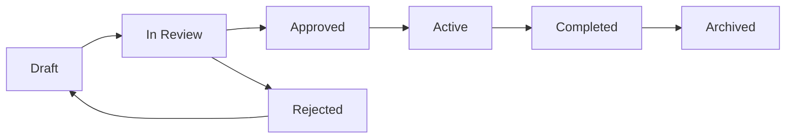

# Workflow Management

ValuePact workflow management governs how initiatives, business cases, and approvals move from idea to outcome. You configure statuses, approvals, escalations, and automation in one place.

## Who this is for

Admin
Executive
End User

## Prerequisites

- Tenant Admin or Content Admin role
- Familiarity with [initiatives](../core-concepts/initiatives.md) and [business cases](../core-concepts/business-cases.md)
- Completed [user roles](../getting-started/user-roles.md) onboarding

## Capabilities overview

| Capability | What it does | Typical user |
|-----------|--------------|-------------|
| Statuses | Define states and valid transitions | Admin |
| Lifecycle management | Stage gates from creation to archive | Admin, Executive |
| Approval workflows | Multi-stage reviews with role-based gates | Admin |
| Escalations | Timeout rules and override paths | Admin |
| Automation | Trigger actions based on status or field changes | Admin |
| Diagrams | Visual workflow maps for training and compliance | All |

## How workflows connect to the value lifecycle

## Step-by-step: open the workflow editor

1. Navigate to **Admin** > **Configuration** > **Workflows**.
2. Select the entity type: **Initiative**, **Business Case**, or **Approval**.
3. Click **Edit** to modify the active workflow definition.
4. Make changes in the canvas or JSON editor.
5. Click **Save Draft**, then **Publish** to activate.

!!! warning "Publishing impact"
    Publishing a workflow definition applies immediately to new records. In-flight records continue on the previous version unless you migrate them.

## Workflow configuration checklist

Before publishing a workflow, verify:

- [ ] All required statuses are defined
- [ ] Transitions connect every status to at least one other status
- [ ] Approval stages have approvers and timeouts
- [ ] Automation rules are tested on a sample record
- [ ] Stage gates do not block legitimate use cases
- [ ] Diagram renders correctly in **Workflow Diagrams**

## Permissions required

| Role | Permission | Scope |
|------|-----------|-------|
| Super Admin | Configure workflows | Organization |
| Tenant Admin | Configure workflows | Organization |
| Content Admin | Edit workflow drafts | Organization |
| Analyst | View workflow diagrams | Assigned initiatives |
| Viewer | View workflow diagrams | Assigned initiatives |

## Limits and guardrails

Limit Maximum 50 custom statuses per workflow.

Limit Maximum 10 active approval stages per workflow.

Limit Automation rules are evaluated within 60 seconds of a trigger event.

Limit Only one workflow definition can be active per entity type at a time.

## Troubleshooting

??? question "Issue: workflow changes not visible to users"
    **Cause:** The workflow is saved but not published.
    **Resolution:** Open the workflow editor and click **Publish**. Verify the effective date.

??? question "Issue: users cannot transition a record"
    **Cause:** The transition requires a permission the user does not have, or a required field is empty.
    **Resolution:** Check the transition guard in **Workflows** > **Transitions**. Confirm the user holds the required role and all mandatory fields are populated.

??? question "Issue: migration fails for in-flight records"
    **Cause:** The target workflow version lacks a status that matches the current record status.
    **Resolution:** Map the old status to a new status in the migration dialog, or add the missing status to the new workflow before migrating.

## Related pages

- [Statuses](statuses.md)
- [Lifecycle Management](lifecycle-management.md)
- [Approval Workflows](approval-workflows.md)
- [Escalations](escalations.md)
- [Automation](automation.md)
- [Workflow Diagrams](workflow-diagrams.md)
- [Administration Configuration Workflows](../administration/configuration/workflows.md)

## Escalation path

If a workflow definition cannot be published or causes errors:

1. Check [Troubleshooting](../troubleshooting/permission-issues.md) for common fixes.
2. Open a support ticket with severity **High** and include the workflow ID.
3. Escalate to the Platform Engineering team via `#valuepact-ops` if tenant-wide impact is suspected.
