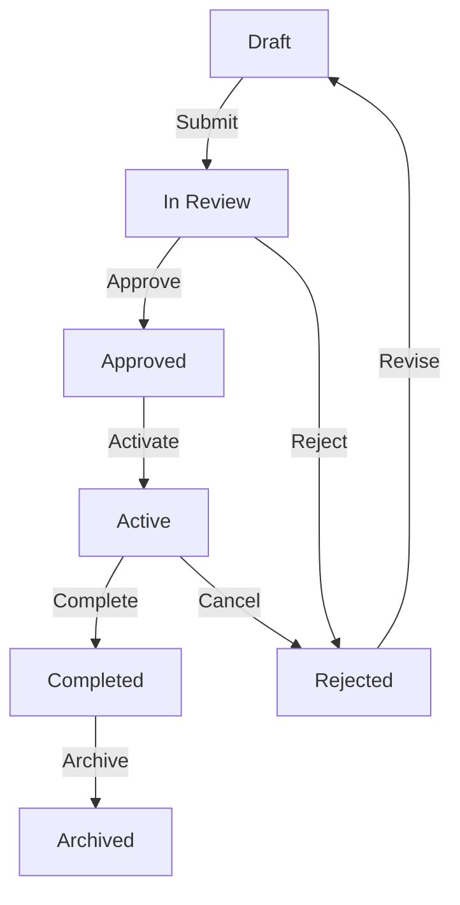
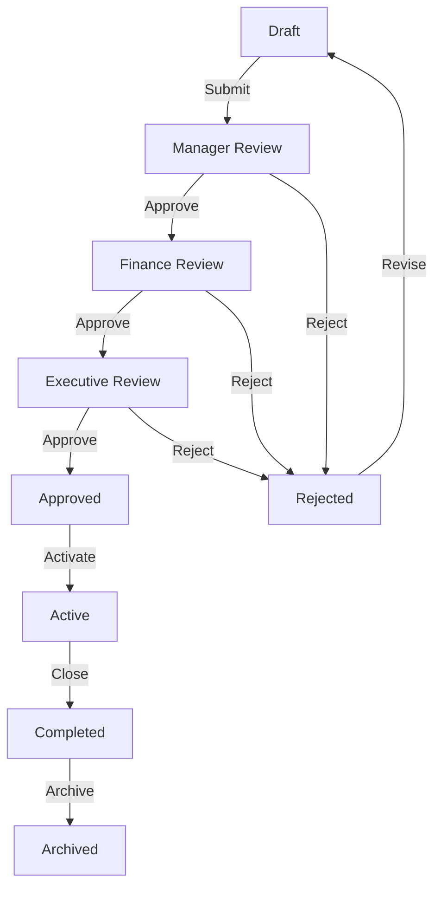
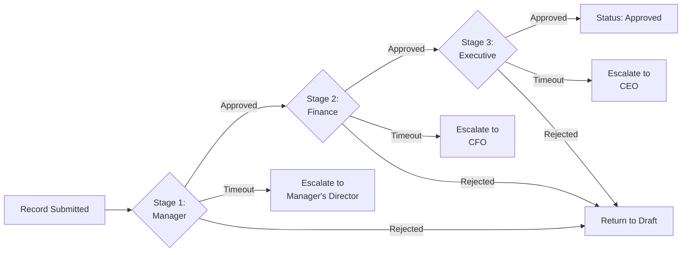
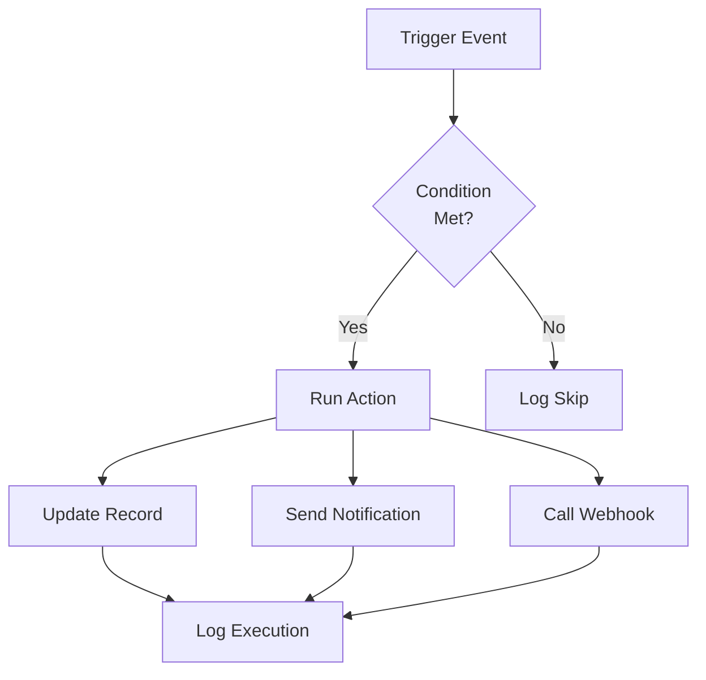

# Workflow Diagrams

Visual diagrams help teams understand governance paths, train new users, and satisfy audit requirements. This page provides canonical diagrams for common ValuePact workflows.

## Who this is for

Admin
Executive
Analyst
End User

## Prerequisites

- Access to [Workflow Management](index.md)
- Familiarity with [statuses](statuses.md) and [approval workflows](approval-workflows.md)

## Initiative workflow

An initiative moves from idea to value realization through review, approval, execution, and closure.

### Key transitions

| Transition | Trigger | Actor |
|-----------|---------|-------|
| Submit | All required fields complete | Analyst, Owner |
| Approve | All approval stages passed | Approver |
| Reject | Any stage rejects | Approver |
| Activate | Scheduled or manual | Admin, Owner |
| Complete | Milestones and actuals captured | Owner, Admin |
| Archive | Retention policy or manual | Admin, Automation |

## Business case workflow

Business cases follow a stricter approval path with financial gates.

### Financial gates

- **Manager Review:** Scope and feasibility check.
- **Finance Review:** Budget, ROI, and cash flow validation.
- **Executive Review:** Strategic alignment and risk sign-off.

## Approval routing diagram

This diagram shows how a record moves through multi-stage approval with escalation.

## Automation trigger diagram

Automation rules react to record events and external triggers.

## Diagram usage tips

| Use case | How to access |
|----------|---------------|
| Training | Export from **Workflows** > **Diagrams** as PNG or SVG |
| Audit | Include the diagram in compliance evidence packages |
| Review | Share the diagram link with stakeholders before publishing changes |

## Permissions required

| Role | Permission | Scope |
|------|-----------|-------|
| Super Admin | View all diagrams | Organization |
| Tenant Admin | View all diagrams | Organization |
| Content Admin | View all diagrams | Organization |
| Analyst | View diagrams for assigned workflows | Assigned workflows |
| Viewer | View diagrams for assigned workflows | Assigned workflows |

## Limits and guardrails

Limit Diagrams are generated from the published workflow definition. Unpublished changes are not reflected.

Limit Mermaid diagrams support up to 50 nodes per workflow. Split complex workflows into sub-workflows if needed.

## Troubleshooting

??? question "Issue: diagram does not match current workflow"
    **Cause:** The workflow was edited but not published, or the page cache is stale.
    **Resolution:** Publish the workflow and refresh the page. Diagrams update within 5 minutes of publish.

??? question "Issue: Mermaid diagram fails to render"
    **Cause:** The diagram syntax contains unsupported characters or exceeds node limits.
    **Resolution:** Reduce the number of stages or use shorter labels. Avoid special characters in status names.

## Related pages

- [Workflow Management Overview](index.md)
- [Statuses](statuses.md)
- [Approval Workflows](approval-workflows.md)
- [Escalations](escalations.md)
- [Automation](automation.md)

## Escalation path

For diagram rendering failures or incorrect visualizations:

1. Export the workflow definition JSON from **Configuration** > **Workflows** > **Export**.
2. Verify the JSON structure against the schema in [API Docs](../api/endpoints/initiatives.md).
3. File a support ticket with the exported JSON and a screenshot.
4. Escalate to `#valuepact-ops` if the issue blocks an audit.
