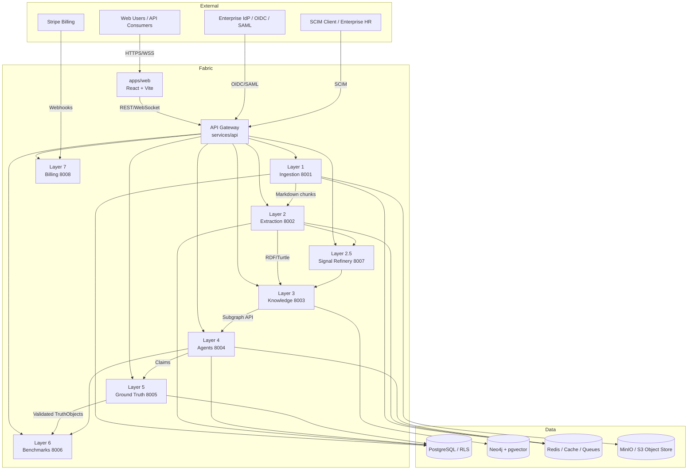
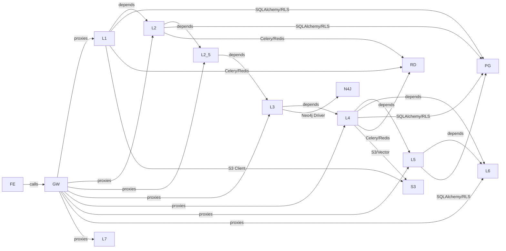

# Value Fabric — Enterprise Architecture

Value Fabric is an enterprise B2B SaaS platform built as a **six-layer semantic microservices pipeline**. The architecture is designed for multi-tenant isolation, observability, horizontal scalability, and compliance with SOC2-class controls.

## System Context

## Layer Inventory

| Layer | Service | Port | Runtime | Purpose | Canonical Source |
| ----- | ------- | ---- | ------- | ------- | ------------------ |
| Frontend | `apps/web` | 3001 / 3000 | React + Vite + TanStack Query | User-facing value studio | `apps/web/src` |
| Gateway | `services/api` | 8000 | FastAPI | Cross-layer auth, routing, rate limiting | `services/api/app` |
| 1 | `services/layer1-ingestion` | 8001 | FastAPI + Celery + Playwright | Intelligent data ingestion, crawling, compliance | `services/layer1-ingestion/src` |
| 2 | `services/layer2-extraction` | 8002 | FastAPI + Pydantic v2 | Ontology-guided extraction, RDF/OWL | `services/layer2-extraction/src` |
| 2.5 | `services/layer2-5-signal-refinery` | 8007 | FastAPI | Signal refinement, enrichment, normalization | `services/layer2-5-signal-refinery/src` |
| 3 | `services/layer3-knowledge` | 8003 | FastAPI + Neo4j | Knowledge graph, GraphRAG, hybrid retrieval | `services/layer3-knowledge/src` |
| 4 | `services/layer4-agents` | 8004 | FastAPI + LangGraph | Agentic workflows, ROI, business cases | `services/layer4-agents/src` |
| 5 | `services/layer5-ground-truth` | 8005 | FastAPI | TruthObject validation, maturity ladder | `services/layer5-ground-truth/src` |
| 6 | `services/layer6-benchmarks` | 8006 | FastAPI | Peer comparison, statistical validation | `services/layer6-benchmarks/src` |
| 7 | `services/layer7-billing` | 8008 | FastAPI | Subscription, usage, entitlements | `services/layer7-billing/src` |

## Dependency Graph

## Data Flow

1. **Ingestion (L1)** — Enterprise sources (web, documents, CRM, APIs) are crawled and parsed into markdown chunks. Files are stored in S3-compatible object storage. Job state is tracked in PostgreSQL.
2. **Extraction (L2)** — Chunks are fed through Pydantic v2 models and LLM extractors to produce structured entities, facts, and provenance. Output is serialized as RDF/Turtle.
3. **Signal Refinement (L2.5)** — Extracted signals are deduplicated, enriched, and normalized before graph ingestion.
4. **Knowledge Graph (L3)** — Entities and relationships are written to Neo4j. Vector embeddings are stored in Neo4j native vector indexes or pgvector. GraphRAG and hybrid retrieval power downstream reasoning.
5. **Agents (L4)** — LangGraph workflows orchestrate reasoning over the knowledge graph to generate ROI analyses, whitespace, and business cases. Checkpoints are persisted to PostgreSQL.
6. **Ground Truth (L5)** — TruthObject validation and a maturity ladder verify claims against evidence.
7. **Benchmarks (L6)** — Statistical comparison against peer datasets and benchmarks.

## Cross-Cutting Concerns

| Concern | Implementation | Evidence |
| ------- | -------------- | -------- |
| Tenant isolation | PostgreSQL RLS + `GovernanceMiddleware` + tenant context | `tests/security/test_rls_enforcement.py`, `tests/security/test_tenant_isolation.py` |
| Authentication | OIDC via Keycloak/Clerk; JWT validation; API keys | `services/api/app/auth*`, `infra/keycloak/` |
| Authorization | RBAC roles + ABAC policies via OPA | `infra/opa/policies/`, `tests/security/test_rbac.py` |
| Audit logging | Append-only audit events with structured logging | `tests/audit/`, `services/*/src/audit*` |
| Secrets management | Infisical + short-lived OIDC; no secrets in repo | `gitleaks`, `.infisical.json`, `pnpm env:dev` |
| Observability | OpenTelemetry traces, Prometheus metrics, structured logs | `tests/contract/test_otel_instrumentation.py`, `monitoring/` |
| Health & readiness | `/health`, `/healthz`, `/readyz`, `/metrics` on services | Dockerfiles, service routers |
| Rate limiting | Tenant-scoped rate limits and quotas | `tests/test_tenant_rate_limiting.py`, `tests/abuse/` |
| Idempotency | Idempotency keys on mutating endpoints | `tests/billing/test_webhook_idempotency.py` |
| Migrations | Alembic per service; single-head policy | `make migrate`, `make check-migration-heads` |
| Backups & DR | WAL-G, PITR, documented RPO/RTO | `docs/reliability/dr-policy.md`, `ops/restore_dry_run.py` |
| Billing | Stripe webhooks + usage metering (feature-flagged) | `services/layer7-billing/`, `tests/billing/` |
| Compliance | SOC2 control mapping, DPA template, evidence bundle | `compliance/`, `scripts/compliance/` |
| CI/CD | GitHub Actions with signed artifacts, SBOM, GitOps | `.github/workflows/` |
| IaC | Terraform + Kustomize/K8s | `infra/`, `k8s/`, `.github/workflows/terraform-cd.yml` |
| Container security | Non-root users, slim base images, pinned digests, HEALTHCHECK | Dockerfiles, `scripts/ci/check-k8s-image-digests.sh` |

## Source of Truth Paths

| Concern | Canonical Path |
| ------- | --------------- |
| Runtime Python packages | `services/layer{1-7}-*/src/`, `value_fabric/shared/` |
| Frontend | `apps/web/src` |
| API contracts | `contracts/openapi/*.json`, `contracts/jsonschema/*.json` |
| Kubernetes manifests | `k8s/` |
| Monitoring | `monitoring/` |
| Internal documentation | `docs/` (this tree) |
| Public documentation | `docs-site/` |
| CI/CD | `.github/workflows/` |
| SDK | `sdk/python/` |

## Related Documents

- **Canonical platform architecture (C4 + Mermaid):** [`core-concepts/architecture.md`](core-concepts/architecture.md)
- **System overview & component map:** [`architecture/system-overview.md`](architecture/system-overview.md), [`architecture/component-interaction-map.md`](architecture/component-interaction-map.md)
- **Six-layer rationale:** [`explanations/adr/ADR-002-six-layer-architecture.md`](explanations/adr/ADR-002-six-layer-architecture.md)
- **Runtime path governance:** [`reference/layer-runtime-path-governance.md`](reference/layer-runtime-path-governance.md)
- **Security model:** [`core-concepts/security-model.md`](core-concepts/security-model.md), [`tenant-isolation.md`](tenant-isolation.md)
- **Frontend governance:** [`../DESIGN.md`](../DESIGN.md)
- **DR policy:** [`reliability/dr-policy.md`](reliability/dr-policy.md)
- **SLOs:** [`slo.md`](slo.md)
