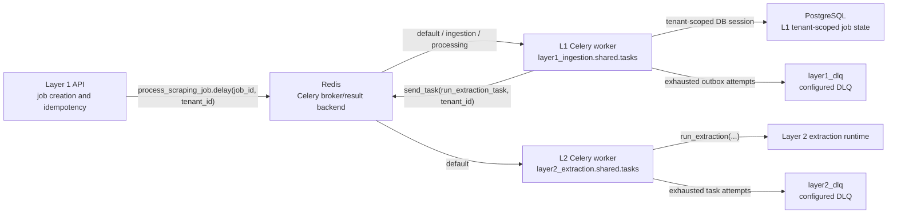

# Background Jobs Architecture

Value Fabric uses Celery for background job execution in the ingestion and
extraction layers. Celery is confirmed in runtime source, dependency metadata,
Docker Compose, Kubernetes manifests, and queue verification tests.

## Runtime Evidence

| Area | Evidence |
| --- | --- |
| Layer 1 Celery app | `services/layer1-ingestion/src/layer1_ingestion/shared/tasks/` (package; `__init__.py`) |
| Layer 1 dependencies | `services/layer1-ingestion/pyproject.toml` includes `celery` and `redis` |
| Layer 2 Celery app | `services/layer2-extraction/src/layer2_extraction/shared/tasks.py` |
| Layer 2 dependencies | `services/layer2-extraction/pyproject.toml` includes `celery` and `redis` |
| Compose workers | `docker-compose.full.yml`, `docker-compose.yml`, `docker-compose.live.yml`, `docker-compose.backend-integrated.yml` |
| Kubernetes workers | `k8s/base/layer1-celery.yaml`, `k8s/base/layer1-ingestion.yml` |
| Verification | `tests/integration/test_celery_queue_topology.py`, run by `pnpm test:queues` |

## Responsibilities

Layer 1 owns ingestion job orchestration. Its Celery app is
`layer1_ingestion.shared.tasks`, with broker and result backend sourced from
`settings.redis_url`, which is populated from `REDIS_URL`.

Layer 2 owns extraction tasks. Its Celery app is
`layer2_extraction.shared.tasks`, with broker and result backend sourced from
`REDIS_URL`.

Layer 1 dispatches extraction work to Layer 2 by sending the fully qualified
task name `layer2_extraction.shared.tasks.run_extraction_task`. The dispatch
payload includes `tenant_id`, `job_id`, source content, extraction options, and
the optional extraction schema.

## Runtime Guarantees

- Broker configuration: Redis is the broker and result backend for L1 and L2.
- Worker startup: L1 worker startup is declared in Compose and Kubernetes; L2
  worker startup is declared in development Compose.
- Queue names: L1 declares `default`, `ingestion`, `processing`, and
  `layer1_dlq`; L2 declares `default` and `layer2_dlq`.
- Retry policy: Celery tasks retain `max_retries`, default retry delay, late
  acknowledgement, and worker-lost rejection settings.
- Dead-letter behavior: L1 and L2 define DLQ queue names, and L1 outbox dispatch
  moves exhausted outbox events to a persisted dead-letter status.
- Tenant context: L1 task entrypoints accept trusted `tenant_id`, set database
  tenant context before repository access, and propagate tenant context to L2.
- Job idempotency: L1 trigger endpoints preserve Redis-backed idempotency keys
  for immediate execution requests.

## Topology



## Verification

Run:

```bash
pnpm test:queues
```

For live environment inventory, run:

```bash
docker compose ps
```

`docker compose ps` reports current service state only. It does not replace the
static configuration gate and does not prove worker health unless the stack is
running.
