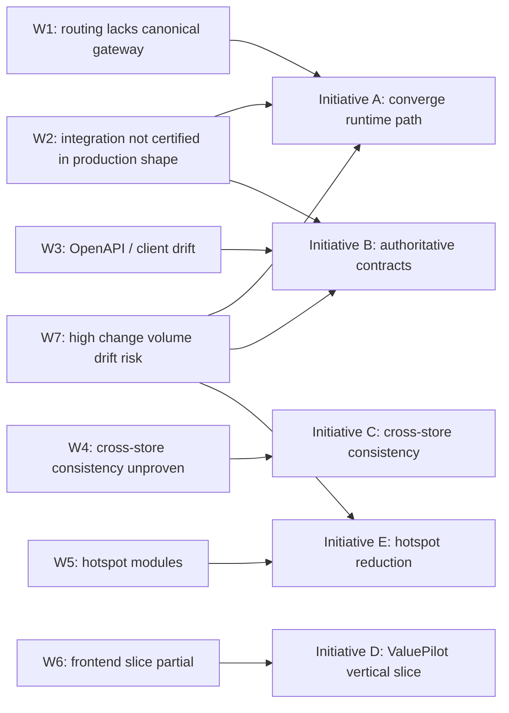

# Value Fabric 4L — Architecture Transformation Technical Report

> **Status:** Working draft for executive review and technical planning
> **Current platform score:** 7.5 — **Target:** 8.7
> **Primary theme:** Architectural convergence with contract authority, proven cross-store consistency, a completed vertical slice, and disciplined hotspot reduction
> **Companion docs:** [Health Scorecard](../health-scorecard.md) · [System Overview](./system-overview.md) · [Platform Contract](../contract.md)

---

## Table of Contents

1. [Executive Summary](#1-executive-summary)
2. [Baseline Assessment](#2-baseline-assessment)
3. [Issue-to-Initiative Mapping](#3-issue-to-initiative-mapping)
4. [Initiatives](#4-initiatives)
   - [A — Converge on One Runtime Path](#4a--converge-on-one-runtime-path)
   - [B — Make Contracts Authoritative](#4b--make-contracts-authoritative)
   - [C — Prove Cross-Store Consistency](#4c--prove-cross-store-consistency)
   - [D — Finish the ValuePilot Vertical Slice](#4d--finish-the-valuepilot-vertical-slice)
   - [E — Reduce Structural Hotspots](#4e--reduce-structural-hotspots)
5. [Vertical-Slice and Convergence Emphasis](#5-vertical-slice-and-convergence-emphasis)
6. [Tracking and Compliance Dashboard](#6-tracking-and-compliance-dashboard)
7. [Success Definition and Next Steps](#7-success-definition-and-next-steps)

---

## 1. Executive Summary

Value Fabric is a production-grade, six-layer AI platform that transforms raw data into value analytics across ingestion, extraction, knowledge, agents, ground truth, and benchmarks. The platform currently scores **7.5 / 10**, with a near-term target of **8.7 / 10**.

The gap is not a shortage of capability — each layer is individually functional and well-tested. It is a **convergence and control problem**:

- Too many competing runtime paths mean the topology that is reviewed and tested is not always the one that runs in production.
- Contracts drift from their generated clients, so a silent shape change in one layer breaks an unknowable set of consumers.
- Cross-store writes (PostgreSQL + Neo4j) are asserted to be consistent rather than certified under failure.
- The frontend modernization has not yet completed a single canonical vertical slice, so its patterns cannot be certified or safely extended.
- Large hotspot modules concentrate change risk under very high change volume.

The path to 8.7 is therefore **five targeted, measurable initiatives** that converge the platform around a single source of truth for routing, contracts, persistence, and UI patterns:

| Theme | Initiative | Core Output |
|---|---|---|
| **Architectural convergence** | A — Converge on one runtime path | One canonical gateway; all layer services private |
| **Contract authority** | B — Make contracts authoritative | OpenAPI generated from source; zero drift in CI |
| **Cross-store consistency** | C — Prove cross-store consistency | Outbox/saga coordinator; reconciliation via jobs |
| **Vertical-slice completion** | D — Finish the ValuePilot vertical slice | One canonical end-to-end journey, fully certified |
| **Hotspot reduction** | E — Reduce structural hotspots | All modules under size/complexity ratchets |

Every initiative carries explicit, CI-enforceable acceptance metrics, so progress is **objective** rather than aspirational.

---

## 2. Baseline Assessment

### 2.1 Current Scorecard

| Measure | Current | Target | Gap |
|---|---|---|---|
| Platform architecture score | **7.5** | **8.7** | 1.2 |

The score is a composite of the weaknesses below. Closing the score means closing the systemic risks that pull it down — not editing the number.

### 2.2 Identified Weaknesses

| ID | Weakness | Current State | Direction | Primary Initiative |
|---|---|---|---|---|
| **W1** | Production routing does not implement the canonical gateway architecture. | Direct `/layer1`–`/layer6` public backends; multiple competing ingress configurations exist. | Route 100% of public traffic through the gateway; make every layer service private. | **A** |
| **W2** | Cross-layer integration exists but is not continuously certified in production shape. | Integration is demonstrated, but not under the exact production topology on every change. | Add production-shape contract and CI certification. | **A, B** |
| **W3** | OpenAPI and generated-client drift still occurs. | Contracts and generated TypeScript/Python clients drift from runtime source. | Make generation single-command and fail CI on diff. | **B** |
| **W4** | PostgreSQL and Neo4j writes lack fully proven cross-store consistency. | No certified coordinator for the store boundary. | Complete the transaction coordinator; prove rollback and recovery. | **C** |
| **W5** | Large hotspot modules remain, including Layer 1 task orchestration. | Oversized modules concentrate change risk. | Split along stable domain boundaries under ratchets. | **E** |
| **W6** | The ValuePilot frontend modernization covers only part of the application. | The slice is not yet end-to-end complete or certified. | Finish the canonical vertical slice before extending. | **D** |
| **W7** | Very high change volume increases architecture drift risk. | High churn erodes consistency without enforcement. | Authoritative contracts + CI gates + hotspot ratchets. | **A, B, E** |

---

## 3. Issue-to-Initiative Mapping

Every weakness maps to at least one initiative. The mapping is intentionally one-to-many because drift (W7) is a **multiplier**: it must be addressed by the same mechanisms that enforce convergence (A, B, E).

| Weakness | Required Action | Where Enforced |
|---|---|---|
| W1 | Gateway convergence | A, plus static CI route check |
| W2 | Production-shape continuous certification | A network tests, B contract tests, E fitness tests |
| W3 | Authoritative, drift-free contracts | B generation + diff gate + compliance gate |
| W4 | Cross-store transaction coordinator | C coordinator + failure injection + reconciliation |
| W5 | Hotspot reduction | E size/complexity ratchets + dead-code removal + ADR gate |
| W6 | Completed vertical slice | D view-model, Zod, query-key, invalidation certification |
| W7 | Drift resistance under change volume | A + B + E enforceable CI gates on every PR |

---

## 4. Initiatives

## 4.A — Converge on One Runtime Path

### Why it matters

With multiple competing ingress configurations, the production-observed topology is not necessarily the one that was reviewed, tested, or governed. Every public route that bypasses the gateway skips the common middleware (tenant, auth, quota, audit, request correlation), and undocumented backends become de-facto entry points. Convergence is the foundation for every other control in this report.

### Objective

Ratify one canonical production gateway and make every layer service unreachable from the public internet.

### Implementation steps

1. **Ratify one production ingress for v1.** Choose NGINX as the ingress — the lowest-risk option given the current repository.
2. **Route all public API traffic through `services/api`.** The gateway becomes the only consumer-facing API surface.
3. **Remove direct `/layer1` … `/layer6` public backends.** No layer service is directly scoped to public traffic.
4. **Make every layer service a private `ClusterIP`.** Layer services are reachable only from inside the trusted network boundary.
5. **Add NetworkPolicies** permitting each layer access only from: the gateway, approved workers, and observability components. No other principal may reach a layer.
6. **Archive or delete** competing Istio and Gateway API production configurations, unless one has an approved future purpose.
7. **Remove legacy frontend and service routing aliases** after confirming no consumers remain.
8. **Add a static CI test** that rejects any production manifest routing directly to a layer.

### Acceptance metrics

| Metric | Target | Enforcement |
|---|---|---|
| 100% of public API requests traverse the gateway | 100% | Live ingress/proxy tests |
| Zero directly exposed layer services | 0 | Network / manifest scan |
| Zero unregistered public routes | 0 | Route-registry diff |
| Tenant, auth, quota, audit, and request-correlation middleware run on every public request | All present | Middleware assertion on gateway path |
| Static CI rejects any production manifest that routes directly to a layer | Reject on violation | CI / preflight job |

---

## 4.B — Make Contracts Authoritative

### Why it matters

Contracts are the shared specification that every layer, client, and UI consumes. When OpenAPI is drift-prone and clients are generated ad-hoc, a silent shape change in one layer breaks an unknowable set of consumers. A backend response must not change without the contract, generated clients, UI types, and tests changing together.

### Objective

Make the OpenAPI specification the generated expression of runtime source, with zero permitted drift.

### Implementation steps

1. **Generate all OpenAPI specifications from runtime source.** Runtime definitions (route handlers, Pydantic models) are the source of truth — not hand-maintained YAML.
2. **Regenerate TypeScript and Python clients with one canonical command.** A single reproducible path guarantees consistency.
3. **Fail CI when generation produces a diff.** Any divergence from the baseline blocks the merge.
4. **Add consumer-driven contract tests for each cross-layer boundary.** Each layer pair asserts the explicit payload shape and failure modes it consumes.
5. **Reject unknown request fields at trust boundaries.** Fail closed instead of silently ignoring.
6. **Version breaking changes and require migration guidance.** Any breaking change carries a version bump and a documented migration path.

### Acceptance metrics

| Metric | Target | Enforcement |
|---|---|---|
| Zero generated-contract drift for 30 consecutive days | 0 drift days | CI regeneration diff gate |
| 100% of public routes represented in the OpenAPI source | 100% | Route → spec coverage check |
| 100% of generated clients reproduced byte-for-byte in CI | 100% | Byte-for-byte regeneration diff |
| No open contract-hang or contract-shape defects | 0 open | Contract dashboard / defect triage |
| Contract-compliance gate passes on every PR and merge-group candidate | PASS | `contract-compliance` CI gate |

> **Definitions — drift** is when the OpenAPI output differs from the result of the authoritative generation command. **Compliance gate** is the CI job that regenerates, diffs, and runs consumer-driven boundary tests.

---

## 4.C — Prove Cross-Store Consistency

### Why it matters

Layer 3 knowledge-graph persistence spans PostgreSQL and Neo4j, plus vector/index updates. A write that lands in one store but not the other leaves the platform silently inconsistent — the exact failure that undermines evidence-backed claims downstream of Layer 5. Consistency must be certified under injected failure, not assumed.

### Objective

Complete the Layer 3 coordinator and prove exactly-once, recoverable cross-store writes.

### Implementation steps

1. **Complete the Layer 3 Neo4j/PostgreSQL transaction coordinator.**
2. **Use an outbox or durable-saga pattern for cross-store writes.** Both legs flow through durable intent so a partial failure is recoverable.
3. **Attach tenant ID, idempotency key, operation ID, and provenance to every write.** Every write is attributable and replayable.
4. **Add compensating rollback for partial failure.** A failed leg is explicitly compensated, never orphaned.
5. **Add reconciliation jobs and drift metrics.** Periodic reconciliation detects and reports residual divergence.
6. **Test failures at every point between: PostgreSQL commit → Neo4j write → vector/index update.** Failure injection covers each hop.

### Acceptance metrics

| Metric | Target | Enforcement |
|---|---|---|
| Zero unreconciled partial writes in failure-injection tests | 0 | Failure-injection suite |
| Recovery from every injected cross-store failure is deterministic | Deterministic | Recovery table per injected point |
| Reconciliation lag p95 below five minutes | p95 < 5 min | Reconciliation metrics alert |
| Duplicate retries produce exactly one logical business operation | Exactly once | Idempotency / outbox tests |

---

## 4.D — Finish the ValuePilot Vertical Slice

### Why it matters

A partially modernized frontend is worse than either extreme: it exhibits experimental capabilities inconsistently, and it cannot be certified because the slice itself is incomplete. Completing one customer-visible journey — route through domain model, adapter, invalidation, and every state — creates a repeatable template and de-risks every subsequent flow.

### Objective

Complete and certify the canonical `/value-case` journey under one stable route, without raw DTO consumption or cross-tenant query reuse.

### Implementation steps

1. **Use only the canonical route `/t/:tenantSlug/accounts/:accountId/studio/value-case`.**
2. **Complete domain view models and Zod adapters.** Components consume domain models; adapters map raw API DTOs to them.
3. **Prevent components from consuming raw API DTOs.** Enforce at the boundary, not by convention.
4. **Partition every query key by identity, tenant, account, and authorization-snapshot discriminator.** No key may leak across identity or tenant context.
5. **Define deterministic invalidation** after calculation, generation, publishing, and tenant switching.
6. **Add full loading, empty, expired, denied, partial-failure, and retry states** for every async surface in the slice.
7. **Extend the slice pattern to adjacent calculator and deliverable flows only after certification.**

### Acceptance metrics

| Metric | Target | Enforcement |
|---|---|---|
| Zero direct raw-DTO consumption in the vertical slice | 0 | Static / artifact check |
| Zero cross-tenant query-cache reuse | 0 | Query-key isolation tests |
| 100% route-state and identity-transition coverage | 100% | Transition tests |
| Core ValuePilot journey passes against a live backend in every release candidate | PASS | E2E / release-candidate suite |

> The slice must honor [Frontend Governance Contract](../../DESIGN.md) constraints: existing shell/primitives, horizontal tabs, right-rail detail patterns, and TanStack Query conventions.

---

## 4.E — Reduce Structural Hotspots

### Why it matters

Large modules — notably Layer 1 task orchestration — concentrate risk: a single change in a hotspot touches many interacting responsibilities, and high change volume magnifies that blast radius. Extracting stable, correctly scoped modules is a prerequisite for safe growth; otherwise drift spreads through each refactor.

### Objective

Keep every production module within agreed size and complexity ceilings, with zero dependency cycles.

### Implementation steps

1. **Split oversized modules along stable domain boundaries.** Keep Celery registration, route registration, and compatibility surfaces stable during extraction.
2. **Add complexity and module-size ratchets.** CI rejects new or refactored supersized modules.
3. **Remove dead exports, duplicate helpers, legacy aliases, and dormant configuration.**
4. **Require an ADR for any new cross-layer coupling.** New coupling is deliberate, reviewed, and recorded.

### Acceptance metrics

- [ ] No production module above the agreed size threshold without an exception.
- [ ] No net increase in high-complexity functions.
- [ ] Dependency-cycle count remains zero.
- [ ] Architecture fitness tests run on every PR.

| Metric | Target | Enforcement |
|---|---|---|
| Production modules over size threshold without exception | 0 | Module-size ratchet (ADR exception) |
| Net increase in high-complexity functions | 0 | Complexity ratchet |
| Dependency cycles | 0 | Dependency-graph check |
| Fitness tests on every PR | PASS | Fitness / preflight CI |

---

## 5. Vertical-Slice and Convergence Emphasis

Two themes warrant specific executive attention because they concentrate the highest risk and push progress everywhere else.

### 5.1 Architectural convergence

Convergence is the foundation. Until there is exactly one canonical runtime path and one authoritative contract source, every other control — contract tests, tenant isolation, security review — runs against some topology that is not the one deployed. Convergence is what makes "contract authority" and "cross-store consistency" trustworthy, because the guarantees are verified on the real production shape rather than a review artifact.

### 5.2 Vertical-slice completion

The vertical slice is the smallest complete proof that the platform works end-to-end for a real user. It converts the modernization from an aspirational pattern into a certified, reusable template. Finishing it first prevents the rest of the application from extending an unproven pattern — exactly how drift accumulates. Extend the canonical route to adjacent calculator and deliverable flows only after certification.

---

## 6. Tracking and Compliance Dashboard

### 6.1 Consolidated metrics

| Topic Area | Initiative | Metric | Target | Current |
|---|---|---|---|---|
| Convergence | A | Public traffic via the gateway | 100% | In progress |
| Convergence | A | Directly exposed layer services | 0 | In progress |
| Contract | B | Generated-contract drift days | 0/30 | In progress |
| Contract | B | Public routes in OpenAPI | 100% | In progress |
| Contract | B | Generated clients byte-for-byte | 100% | In progress |
| Contract | B | Contract-compliance gate on PR | PASS | In progress |
| Consistency | C | Unreconciled partial writes | 0 | In progress |
| Consistency | C | Reconciliation lag p95 | p95 < 5 min | In progress |
| Slice | D | Raw-DTO consumption | 0 | In progress |
| Slice | D | Cross-tenant cache reuse | 0 | In progress |
| Hotspots | E | Over-threshold modules | 0 | In progress |
| Hotspots | E | High-complexity net increase | 0 | In progress |
| Hotspots | E | Dependency cycles | 0 | In progress |

> Status legend — **In progress / Met / Failing** → assign an owner and a review cadence as the program matures. Update this table each reporting cycle.

### 6.2 CI gates and compliance requirements

| Gate | Initiative | Blocks when violated |
|---|---|---|
| Preflight (`structural-preflight`, export topology, pnpm-only) | A, E | Manifest/reference routing defects |
| OpenAPI drift detection (regeneration + diff) | B | Any drift PR |
| Contract-compliance gate on every PR and merge-group candidate | B | Contract-compliance failure |
| Consumer-driven boundary tests | B, D | Boundary contract failure |
| Fitness / ratchet checks (E) | E | Size / complexity / cycle overruns |
| Static CI test for direct-to-layer routing | A | Manifest route points to a layer |
| Route-state and identity-transition coverage | D | Slice incomplete or regressed |
| ValuePilot journey against a live backend (every release candidate) | D | Release-candidate block |

### 6.3 Reporting cadence

Schedule a recurring architecture review on a release-candidate cadence (at minimum weekly or at each release boundary). Each review:

1. Reads the dashboard table (Section 6.1).
2. Confirms each gate passed in the latest CI run.
3. Flags anything in progress or not met, and re-assigns the date/owner.
4. Updates the composite score trend toward 8.7.

---

## 7. Success Definition and Next Steps

**Success** is the platform score crossing **8.7 / 10** with every initiative's acceptance metrics consistently green — not a one-off, but across the reporting horizon.

| Phase | Initiative | Milestone |
|---|---|---|
| **Phase 0 — Freeze** | — | Ratify this report; capture baseline metrics and reference gates. |
| **Phase 1 — Convergence** | A | Stand the gateway path + static route guard; archive competing ingress configs. |
| **Phase 2 — Contracts** | B | Single generation command + diff gate; contract dashboard active. |
| **Phase 3 — Consistency** | C | Coordinator + recovery table + reconciliation jobs. |
| **Phase 4 — Slice** | D | Complete the ValuePilot journey; enforce view-model / query-key boundaries; cert live journey. |
| **Phase 5 — Hardening** | E | Complexity and size ratchets; ADR gate; dependency cycles remain zero. |
| **Phase 6 — Certification** | Audit | Audit the gate stack against 8.7 and green for release. |

Each phase hardens its initiative acceptance metrics. **Do not claim a phase complete unless its acceptance criteria are demonstrated green** on the running dashboard.

---

*Report ends. All names, metrics, and acceptance criteria derive from the 7.5 → 8.7 transformation case.*