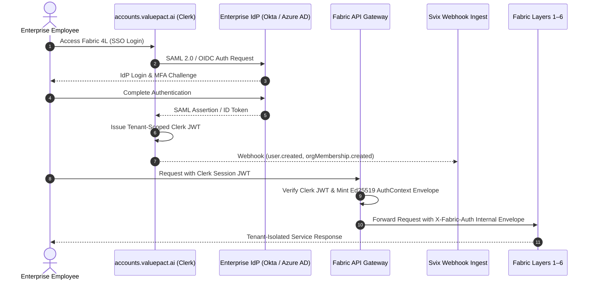

# Enterprise SSO & Identity Provisioning Guide

## Overview

Fabric 4L integrates enterprise-grade Single Sign-On (SSO) and Directory Sync (SCIM) via Clerk Enterprise Connections. This architecture enables multi-tenant enterprise customers to authenticate using their centralized Identity Provider (IdP) — including Okta, Microsoft Entra ID (Azure AD), Google Workspace, PingFederate, and generic SAML 2.0 / OIDC providers — while maintaining strict trust-boundary isolation across Fabric's six internal platform layers.

---

## 1. Architecture: Enterprise Identity Flow



---

## 2. Supported Connection Protocols

| Protocol | Typical Providers | Supported Features |
|---|---|---|
| **SAML 2.0** | Okta, Azure AD / Entra ID, PingIdentity, OneLogin | SP-initiated, IdP-initiated, JIT user provisioning, Signed Assertions, Encrypted Assertions |
| **OIDC / OAuth 2.0** | Google Workspace, Microsoft Entra ID, Auth0, Custom OIDC | PKCE, Authorization Code Flow, Claims Mapping |
| **SCIM v2.0** | Okta, Microsoft Entra ID | Automated User Provisioning, Deprovisioning, Group/Role Sync |

---

## 3. Step-by-Step Enterprise Onboarding

### Phase 1: Verified Domain Registration
Enterprise organizations enforce SSO by associating one or more verified email domains (e.g. `@acmecorp.com`).

1. **Submit Domain**: The organization admin inputs corporate domain (`acmecorp.com`) in the Organization Settings.
2. **DNS Validation**: Fabric generates a DNS `TXT` record challenge:
   ```
   _clerk-challenge.acmecorp.com  TXT  clerk-verification=f7a8b9c0d1e2f3...
   ```
3. **Verification**: Once DNS propagates, Clerk marks the domain verified and enables SSO enforcement rules.

### Phase 2: IdP Configuration & SAML 2.0 Setup

#### A. Okta SAML Integration
1. In Okta Admin Console, navigate to **Applications** → **Create App Integration** → **SAML 2.0**.
2. Set **Single Sign-On URL (ACS URL)**:
   ```
   https://accounts.valuepact.ai/v1/sso/saml/acs
   ```
3. Set **Audience URI (SP Entity ID)**:
   ```
   https://accounts.valuepact.ai
   ```
4. Map Attribute Statements:
   - `email` → `user.email`
   - `firstName` → `user.firstName`
   - `lastName` → `user.lastName`
   - `groups` → `user.groups`
5. Download Identity Provider metadata XML or copy **Sign On URL**, **Issuer**, and **X.509 Certificate**.
6. Provide metadata to Fabric Admin / Clerk Dashboard under Organization SSO Connection.

#### B. Microsoft Entra ID (Azure AD) Enterprise Application
1. In Azure Portal, navigate to **Enterprise applications** → **New application** → **Create your own application**.
2. Select **Integrate any other application you don't find in the gallery (Non-gallery)**.
3. In **Single sign-on**, choose **SAML**.
4. Configure Basic SAML Configuration:
   - **Identifier (Entity ID)**: `https://accounts.valuepact.ai`
   - **Reply URL (Assertion Consumer Service URL)**: `https://accounts.valuepact.ai/v1/sso/saml/acs`
5. Attributes & Claims:
   - `Unique User Identifier (Name ID)`: `user.userprincipalname`
   - `emailaddress`: `user.mail`
   - `givenname`: `user.givenname`
   - `surname`: `user.surname`
6. Export the **App Federation Metadata XML** or Certificate (Base64).

---

## 4. Role & Group Attribute Mapping

Enterprise SAML assertions provide group memberships that map to Clerk Organization Roles and Fabric 4L permissions:

| IdP Group Name | Clerk Organization Role | Fabric 4L Capability Grants |
|---|---|---|
| `Fabric-Platform-Admins` | `org:admin` | Tenant Admin, RLS full access, billing, audit export |
| `Fabric-Platform-Analysts` | `org:member` | Run workflows, view dashboards, extract entities |
| `Fabric-Platform-Viewers` | `org:viewer` | Read-only access to knowledge graph and truth objects |

Group claims are synchronized during JIT (Just-In-Time) provisioning and continuously updated via SCIM or SAML session re-authentication.

---

## 5. Automated SCIM v2.0 Directory Sync

When an enterprise customer enables SCIM:
1. **Base URL**: `https://accounts.valuepact.ai/v1/scim/v2`
2. **Bearer Token**: Generated per-tenant in Infisical secret vault (`SCIM_SECRET_<TENANT_ID>`).
3. **Operations**:
   - `POST /Users`: Provisions user account and sends initial enrollment notice.
   - `PUT /Users/{id}` / `PATCH /Users/{id}`: Updates user attributes, email, or department.
   - `DELETE /Users/{id}` / Set `active: false`: Immediately deactivates user, triggers session revocation denylist in `AuthDirectory`, and terminates active JWTs across API Gateway.
   - `POST /Groups`, `PATCH /Groups/{id}`: Synchronizes organization team memberships.

---

## 6. Custom Domain & DNS Automation

Enterprise authentication operates on the dedicated custom domain `accounts.valuepact.ai`:

### Production DNS Configuration (Cloudflare / Route53)
```dns
accounts.valuepact.ai.   CNAME   custom.clerk.accounts.dev.
_clerk.accounts.valuepact.ai.  CNAME  _clerk.custom.clerk.accounts.dev.
```

- **TLS / SSL**: Automatic Let's Encrypt / DigiCert issuance and renewal managed via Clerk Edge Certificate automation.
- **HSTS**: Strict-Transport-Security enabled (`max-age=63072000; includeSubDomains; preload`).
- **Zero Third-Party Cookies**: First-party cookie isolation on `valuepact.ai` parent domain ensures seamless Safari / Chrome privacy sandbox compatibility.

---

## 7. Security Best Practices for Enterprise SSO

1. **Enforce SSO Exclusively**: When domain verification is active, enforce "Strict SSO Mode" to disable fallback email/password or personal social logins for corporate domain users.
2. **Force Re-Authentication**: Require 8-hour maximum session lifetimes for privileged administrative roles (`org:admin`).
3. **Automated Deprovisioning**: Ensure enterprise IT connects SCIM or webhook deprovisioning so employee offboarding revokes Fabric 4L access immediately.
4. **IdP Certificate Rollover**: Multi-certificate staging allows IdP admins to test new signing certificates 30 days prior to expiration without authentication downtime.
