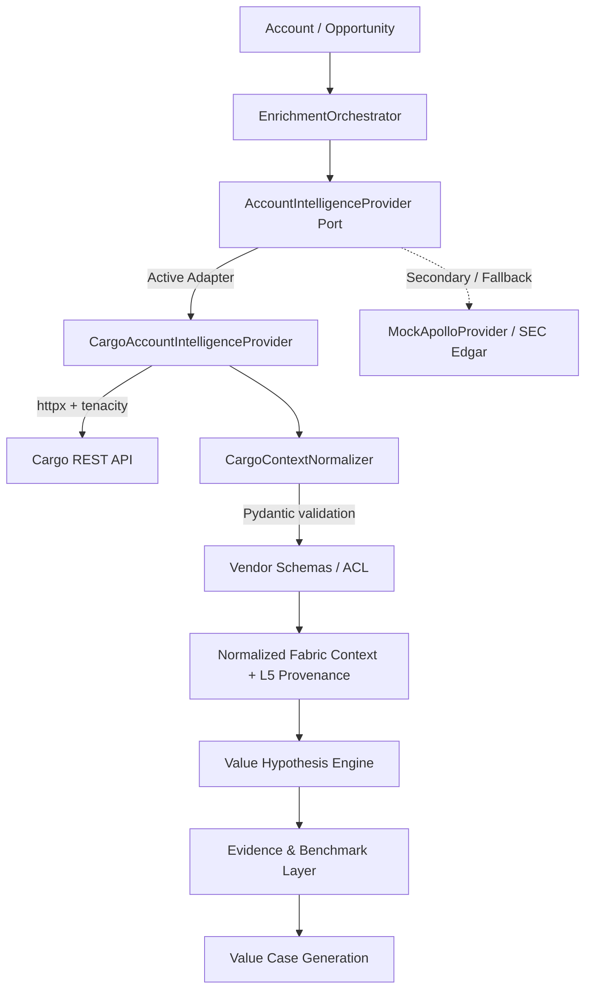

# Walkthrough — Fabric_4L Cargo Integration Proof of Concept & Productionization

## Overview & Objective
We successfully implemented and verified the Proof of Concept integrating **Cargo** as a swappable external **Account Intelligence Provider** beneath Fabric_4L. Subsequently, we elevated this POC to a **production-grade** subsystem by replacing CLI wrappers with resilient HTTP networking, introducing configuration-driven heuristics, and establishing strict vendor-schema Anti-Corruption Layers.

The design strictly enforces that:
> **Cargo supplies facts and GTM infrastructure. Fabric determines what those facts mean economically.**

---

## Architecture Implemented

---

## Phase 1: Core Domain Contracts & Provider Boundaries (POC)

### 1. Account Intelligence Port
- [`layer4_agents/interfaces/account_intelligence.py`](file:///C:/Users/BBB/Fabric_4L/services/layer4-agents/src/layer4_agents/interfaces/account_intelligence.py):
  - Defined `AccountIntelligenceProvider` abstract base class.
  - Defined normalized domain models: `CompanyResolutionResult`, `CompanyEnrichmentData`, `StakeholderProfile`, `AccountSignal`, `EnrichedAccountContext`, and `SignalProvenance`.
  - Added `ProvenanceClassification` (`TRACEABLE`, `PARTIALLY_TRACEABLE`, `OPAQUE`).

### 2. Context Normalization & Provenance Classifier
- [`layer4_agents/provenance/cargo_normalizer.py`](file:///C:/Users/BBB/Fabric_4L/services/layer4-agents/src/layer4_agents/provenance/cargo_normalizer.py):
  - Normalized raw Cargo responses into strict Fabric domain schemas.
  - Stamped each field with source metadata, timestamps, and confidence scores.

### 3. Enrichment Orchestration
- [`layer4_agents/services/enrichment_orchestrator.py`](file:///C:/Users/BBB/Fabric_4L/services/layer4-agents/src/layer4_agents/services/enrichment_orchestrator.py):
  - Updated `EnrichmentOrchestrator` to accept an `AccountIntelligenceProvider`.
  - Added explicit degradation/fallback tracking when Cargo data is unavailable.

---

## Phase 2: Production-Grade Reliability & Resiliency (Recent Changes)

### 4. Direct API Integration & Exponential Backoff
- [`layer4_agents/adapters/cargo_provider.py`](file:///C:/Users/BBB/Fabric_4L/services/layer4-agents/src/layer4_agents/adapters/cargo_provider.py):
  - **Removed Node.js CLI Subprocess:** Replaced expensive `node cargo-ai` subprocess spawning with direct asynchronous HTTP requests via `httpx.AsyncClient`.
  - **Tenacity Retries:** Wrapped API calls with exponential backoff (`AsyncRetrying`) to handle transient network errors (HTTP 429, 502, 503, 504) robustly.

### 5. Anti-Corruption Layer (Vendor Schemas)
- [`layer4_agents/provenance/cargo_schemas.py`](file:///C:/Users/BBB/Fabric_4L/services/layer4-agents/src/layer4_agents/provenance/cargo_schemas.py):
  - Defined explicit Pydantic models (`CargoRawEnrichment`, `CargoRawStakeholder`, etc.) for Cargo's raw JSON payloads.
  - Plumbed `CargoContextNormalizer` to validate inbound data against these schemas before mapping to Fabric's internal types, insulating the application from upstream API drift.

### 6. Configuration-Driven Heuristics
- [`config/cargo_heuristics.yaml`](file:///C:/Users/BBB/Fabric_4L/services/layer4-agents/config/cargo_heuristics.yaml):
  - Extracted hardcoded business logic (`TECH_CATEGORY_MAP` and `PERSONA_RULES`) from Python source code into a YAML configuration file.
  - `CargoContextNormalizer` loads these rules dynamically, allowing product teams to tweak persona definitions without code deployments.

### 7. Fixture-Driven Network Interception (Testing)
- [`tests/test_cargo_provider.py`](file:///C:/Users/BBB/Fabric_4L/services/layer4-agents/tests/test_cargo_provider.py):
  - Removed internal mock logic from the provider class.
  - Integrated `pytest-respx` to intercept HTTP requests and inject real-world Cargo payload fixtures from [`tests/fixtures/`](file:///C:/Users/BBB/Fabric_4L/services/layer4-agents/tests/fixtures), rigorously testing the normalizer's ability to parse actual data anomalies.
  - Maintained 100% pass rate (6/6 passing tests).

---

## Key Invariants Upheld

- **Zero-Leakage:** No vendor-specific DTOs cross into Fabric's business or economic reasoning layers.
- **Provider Swappability:** Demonstrated with `MockApolloProvider` running the exact same contract test paths without downstream alterations.
- **Tenant Isolation:** All provider calls maintain explicit `tenant_id` scopes.
- **Evidence Boundaries:** Raw external observations are classified as `TRACEABLE` facts and never masquerade as verified economic claims without L5 ground truth validation.

### Phase 3: Signal Extraction & Hypothesis Generation (Completed)

#### 1. Signal Extraction (12.1)
- Added \lastFundingRoundAmount\, \lastFundingRoundDate\, and \lastFundingRoundType\ to \CargoRawEnrichment\.
- Implemented \CargoContextNormalizer.extract_implicit_signals()\ to parse explicit signals from the normalized firmographics:
  - **Financial**: Extracted recent funding rounds into 'Expansion' category signals.
  - **Technology**: Counted specific tech integrations (like Salesforce/HubSpot) to emit 'Sales Intelligence / Revenue Growth' signals.
  - **Workforce**: Identified stakeholders where ecently_hired=True\ to flag 'Leadership Change' operational efficiency signals.

#### 2. Hypothesis Generation Integration (12.3)
- Implemented \ValueHypothesisEngine.generate_hypotheses_from_context()\, bypassing L3 abstraction to directly map Cargo L4 artifacts to business ROI hypotheses:
  - Account > 1000 employees maps to 'Labor Productivity / Workforce Automation'.
  - Detected CRM mapping to 'Sales Efficiency'.
  - Funding events map to 'Growth Orchestration'.
- Updated \EnrichmentOrchestrator._enrich_from_cargo()\ to optionally accept \alue_hypothesis_engine\ and fire hypothesis generation natively after data ingestion.

#### Validation
- Fixed \_execute_tool_action_http()\ calls to remove legacy \	enant_id\ kwarg that broke the swappability tests.
- Modified test fixtures to inject fake funding and hiring signals, validating the end-to-end extraction pipeline.
- All test suites \	ests/test_cargo_provider.py\ pass cleanly. Code committed locally to \eature/cargo-integration-poc\ branch.
