# Value Fabric System Architecture

> **In this guide, you will:**
> - Understand the 6-layer core pipeline plus adjacent deployable capabilities
> - Learn how data flows through the system
> - Explore container and component-level designs
> - See deployment topology for production

---

## Prerequisites

Before reading this document:

1. Complete the [Quickstart Guide](../getting-started/quickstart.md)
2. Basic understanding of:
   - REST APIs and microservices
   - Graph databases (Neo4j)
   - Docker and containerization

---

## System Context (C4 Level 1)

Value Fabric is an enterprise agentic SaaS platform that transforms unstructured data into structured, actionable knowledge.

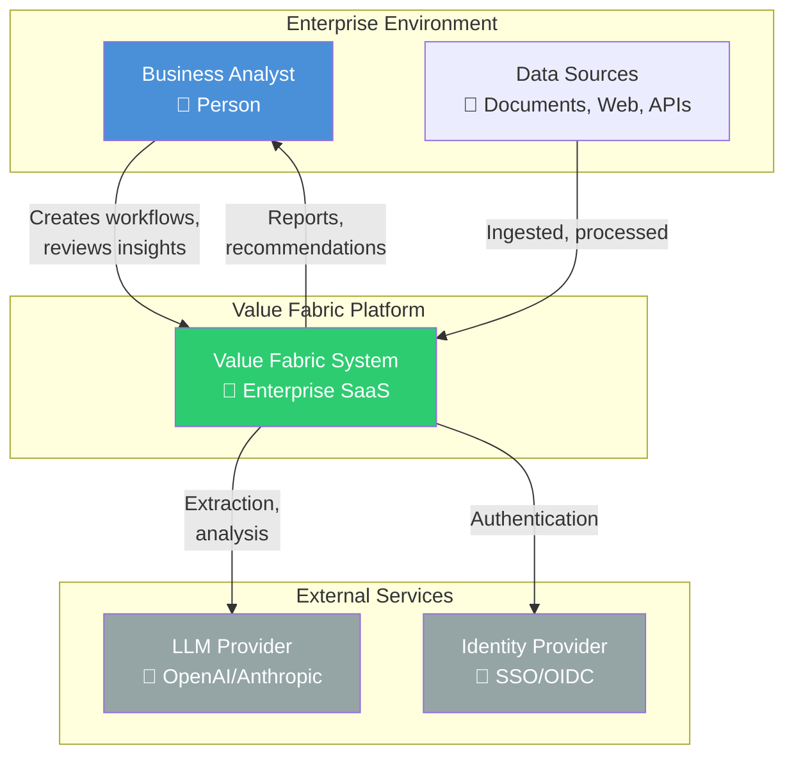

**Key Actors:**
- **Business Analyst**: Creates extraction workflows, reviews generated insights
- **System Integrator**: Connects external data sources, configures SSO
- **Platform Administrator**: Monitors health, manages tenants

---

## Container Architecture (C4 Level 2)

The system follows a 6-layer core pipeline architecture with clear separation of concerns. Signal Refinery is a deployable adjacent capability; Billing is owned by Layer 4 and served on its port. Both are invoked through contracted service boundaries instead of being additional horizontal pipeline layers.

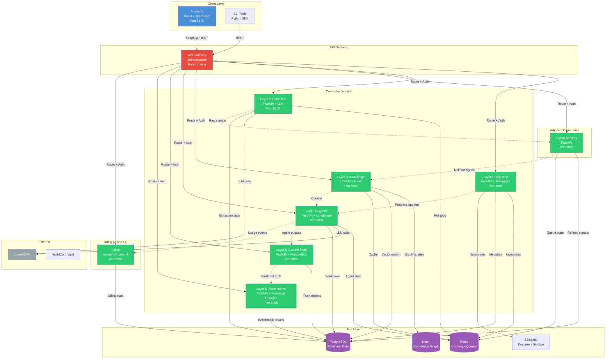

---

## Layer 1: Intelligent Data Ingestion

**Purpose:** Convert unstructured source materials into processable content units

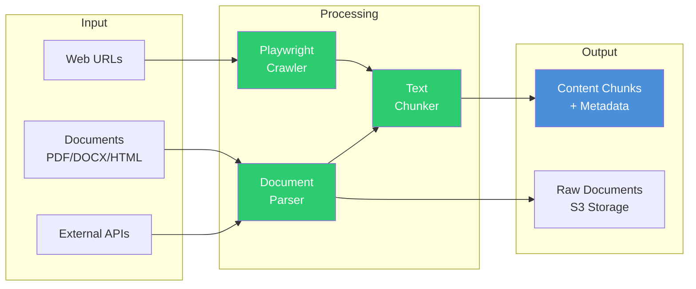

**Key Components:**
| Component | Technology | Purpose |
|-----------|------------|---------|
| Web Crawler | Playwright | JavaScript-rendered page capture |
| Document Parser | pdfplumber, python-docx | Binary document extraction |
| PII Scanner | Presidio | Sensitive data detection |
| Chunker | Sentence-transformers | Semantic text segmentation |

---

## Layer 2: Ontology-Guided Extraction

**Purpose:** Identify entities and relationships using LLM-guided extraction

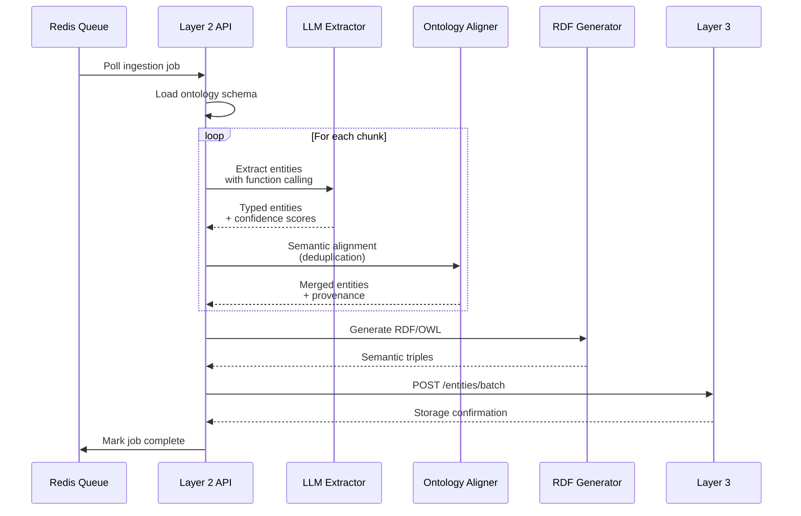

**Entity Taxonomy:**
```
Capability → UseCase → Persona → ValueDriver
     ↓           ↓          ↓           ↓
  What the    How it's   Who uses   Business
  system does  applied    it         benefit
```

---

## Adjacent Capability: Signal Refinery

**Purpose:** Normalize, deduplicate, and enrich Layer 2 extraction output into trusted, evidence-backed `ValueSignal` objects before graph ingestion.

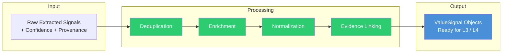

**Key Behaviors:**
| Behavior | Purpose |
|----------|---------|
| Deduplication | Collapse near-duplicate signals from overlapping sources |
| Enrichment | Add derived context, units, and temporal scope |
| Normalization | Map signals to canonical ontology shapes |
| Evidence linking | Preserve provenance, document references, and confidence metadata |

**Canonical source:** `services/layer2-5-signal-refinery/src`

**Boundary rule:** Signal Refinery is adjacent to the core pipeline. It consumes Layer 2 output and pushes to Layer 3 through contracted API/client boundaries; it must not import Layer 2 or Layer 3 runtime modules directly.

---

## Layer 3: Knowledge Graph & Semantic Layer

**Purpose:** Store, query, and reason over extracted knowledge

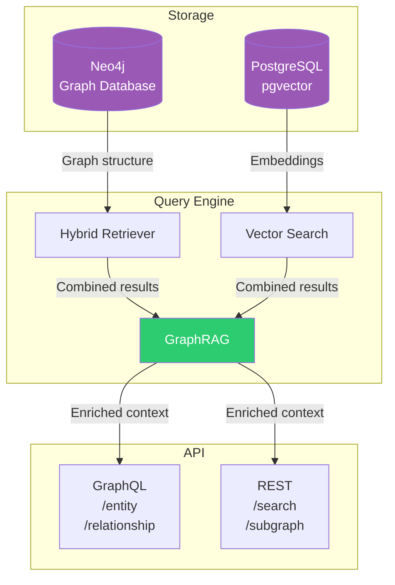

**Retrieval Pattern:**
1. **Vector Search**: Semantic similarity using pgvector
2. **Graph Traversal**: 1-3 hop neighbor expansion in Neo4j
3. **Hybrid Reranking**: Combine semantic + structural relevance

---

## Layer 4: Agentic Workflow Engine

**Purpose:** Orchestrate multi-agent workflows with business logic

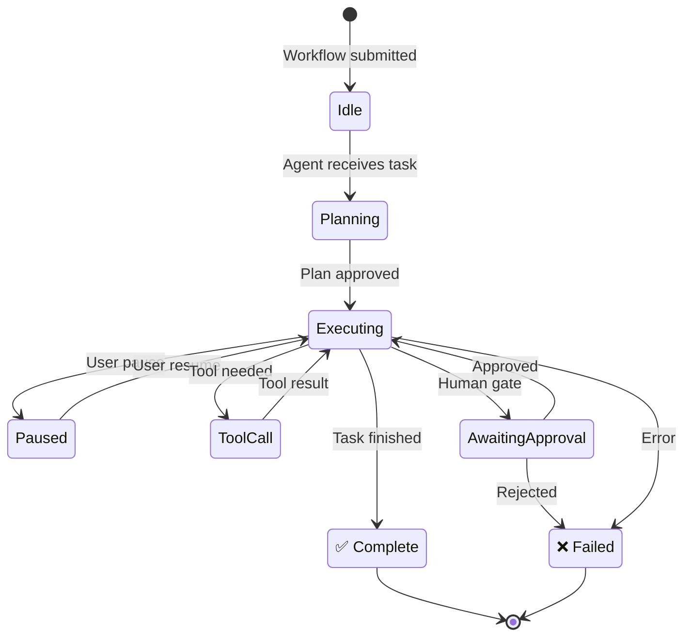

**Agent Types:**
| Agent | Responsibility | Tools |
|-------|---------------|-------|
| Business Analyst | ROI analysis, case building | Query, Calculate, Generate |
| Data Engineer | Extraction monitoring | Ingest, Validate |
| Auditor | Compliance checking | AuditLog, Verify |

---

## Adjacent Capability: Billing

**Purpose:** Tenant-scoped subscription, usage metering, entitlements, and Stripe webhook handling.

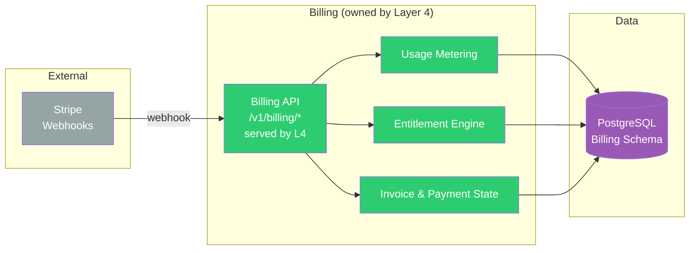

**Key Responsibilities:**
| Responsibility | Description |
| ---------------- | ----------- |
| Plans & subscriptions | Product plans, trials, and subscription lifecycle |
| Usage events | Metered usage aggregation and billing records |
| Entitlements | Tenant-scoped feature access decisions |
| Stripe webhooks | Verified webhook ingestion and idempotent processing |

**Canonical source:** `services/layer4-agents/src` (billing runtime); contract in `contracts/openapi/layer7-billing.json`

**Boundary rule:** Billing is owned by Layer 4 and served on port 8004 under `/v1/billing/*`. Core services interact with it through entitlement, usage-event, and webhook contracts; request handlers must not perform synchronous external provider calls except verified webhook or explicitly idempotent callback paths.

---

## Data Flow: End-to-End

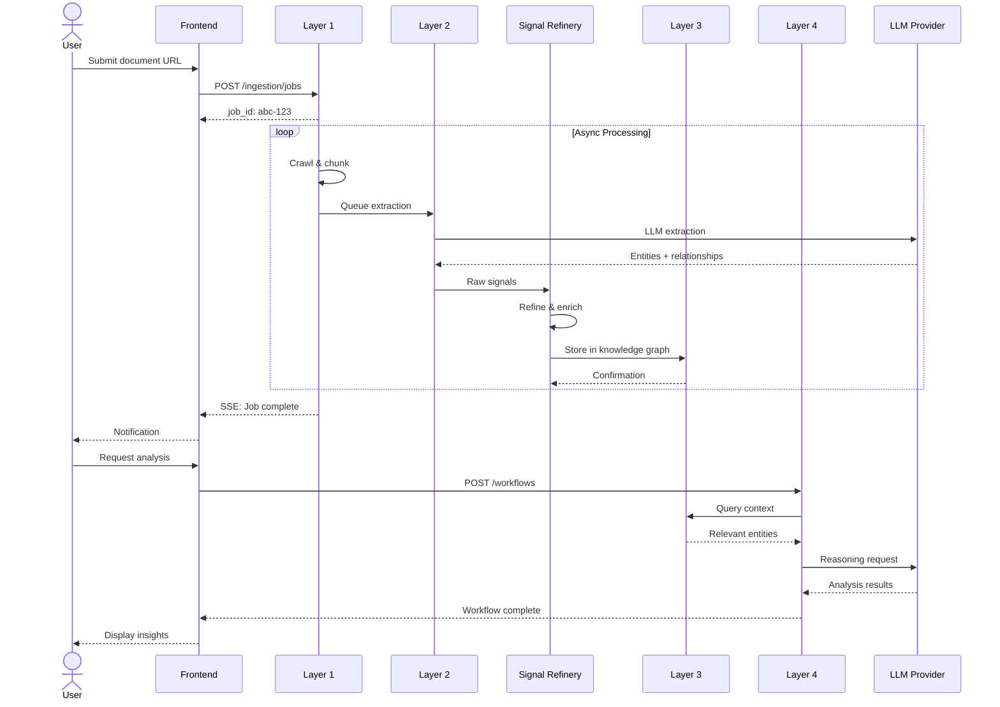

---

## Deployment Topology (Production)

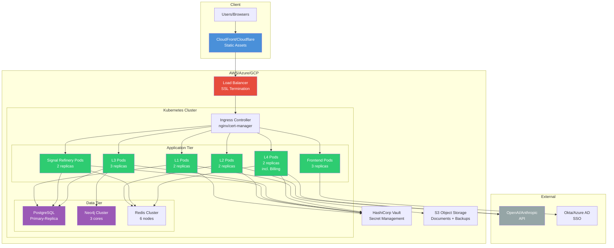

---

## Component Dependencies

| Layer | Upstream | Downstream | Data Stores |
|-------|----------|------------|-------------|
| L1: Ingestion | External sources, User uploads | L2 via Redis | PostgreSQL, S3 |
| L2: Extraction | L1 via Redis | Signal Refinery via HTTP, L3 contract where applicable | PostgreSQL |
| Signal Refinery | L2 via HTTP | L3 via HTTP | PostgreSQL, Redis |
| L3: Knowledge | Signal Refinery via HTTP, L4 queries | L4 context | Neo4j, PostgreSQL, Redis |
| L4: Agents | L3 context, User workflows | Frontend SSE, Billing usage events | PostgreSQL, Redis |
| L5: Ground Truth | L4 agent outputs | L6 benchmark input | PostgreSQL |
| L6: Benchmarks | L5 validated truth | Reports, scorecards | PostgreSQL |
| Billing | L4 usage events, Stripe webhooks (served by L4) | Entitlement decisions | PostgreSQL |

---

## Security Boundaries

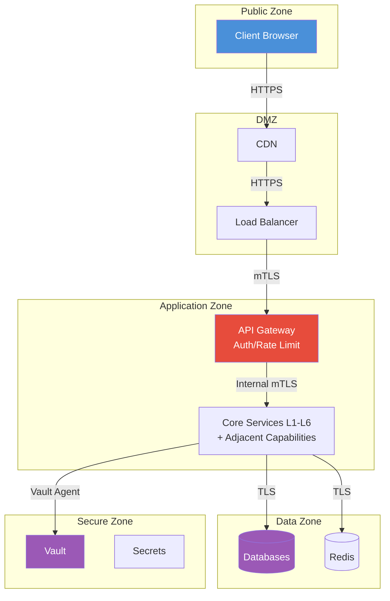

---

## Key Design Decisions

| Decision | Rationale | Trade-off |
|----------|-----------|-----------|
| 6-layer core pipeline plus adjacent capabilities | Clear core boundaries (L1-L6), with signal refinement as a bounded capability and billing owned by Layer 4 | Network overhead between services |
| Signal Refinery | Separates extraction noise from trusted graph signals | Extra hop between L2 and L3 |
| Billing | Isolates subscription/usage/entitlements from core agent workflows (owned by L4) | Single L4 deploy surface |
| Neo4j for knowledge | Native graph operations, Cypher | Operational complexity |
| PostgreSQL + pgvector | Unified relational + vector store | Not specialized vector DB |
| LangGraph for agents | Stateful orchestration, pause/resume | Learning curve |
| Redis for queues | Simple, fast job queuing | Not persistent by default |

See [Architecture Decision Records](../explanations/adr/) for detailed rationale.

---

## Performance Characteristics

| Metric | Target | Achieved |
|--------|--------|----------|
| Ingestion throughput | 100 docs/min | 85 docs/min |
| Extraction latency (p95) | <30s | 25s |
| Graph query latency (p99) | <100ms | 75ms |
| Agent workflow response | <5s | 3.2s |
| System availability | 99.9% | 99.95% |

---

## Cross-Cutting Concerns

| Concern | Implementation | Evidence |
| ------- | -------------- | -------- |
| Tenant isolation | PostgreSQL RLS + governance middleware + tenant context | `tests/security/test_rls_enforcement.py`, `tests/security/test_tenant_isolation.py` |
| Authentication | OIDC via Keycloak/Clerk; JWT validation; API keys | `services/api/app/auth*`, `infra/keycloak/` |
| Authorization | RBAC roles + ABAC policies via OPA | `infra/opa/policies/`, `tests/security/test_rbac.py` |
| Audit logging | Append-only audit events with structured logging | `tests/audit/`, `services/*/src/audit*` |
| Secrets management | Infisical + short-lived OIDC; no secrets in repo | `gitleaks`, `.infisical.json`, `pnpm env:dev` |
| Observability | OpenTelemetry traces, Prometheus metrics, structured logs | `tests/contract/test_otel_instrumentation.py`, `monitoring/` |
| Health & readiness | `/health`, `/healthz`, `/readyz`, `/metrics` on services | Dockerfiles, service routers |
| Rate limiting | Tenant-scoped rate limits and quotas | `tests/test_tenant_rate_limiting.py`, `tests/abuse/` |
| Idempotency | Idempotency keys on mutating endpoints | `tests/billing/test_webhook_idempotency.py` |
| Migrations | Alembic per service; single-head policy | `make migrate`, `make check-migration-heads` |
| Backups & DR | WAL-G, PITR, documented RPO/RTO | `docs/reliability/dr-policy.md`, `ops/restore_dry_run.py` |
| Billing | Stripe webhooks + usage metering (owned by Layer 4) | `services/layer4-agents/`, `tests/billing/` |
| CI/CD | GitHub Actions with signed artifacts, SBOM, GitOps | `.github/workflows/` |
| Container security | Non-root users, slim base images, pinned digests, HEALTHCHECK | Dockerfiles, `scripts/ci/check-k8s-image-digests.sh` |

---

## Source of Truth Paths

| Concern | Canonical Path |
| ------- | --------------- |
| Runtime Python packages | `services/layer{1-6}-*/src/`, adjacent service packages, `packages/shared/src/value_fabric/shared/` |
| Frontend | `apps/web/src` |
| API contracts | `contracts/openapi/*.json`, `contracts/jsonschema/*.json` |
| Kubernetes manifests | `k8s/` |
| Monitoring | `monitoring/` |
| Internal documentation | `docs/` |
| Public documentation | `docs-site/` |
| CI/CD | `.github/workflows/` |
| SDK | `sdk/python/` |

---

## Next Steps

| Goal | Next Document |
|------|---------------|
| Understand security model | [Security Model](./security-model.md) |
| Learn about ontology | [Ontology System](./ontology-system.md) |
| Deploy to production | [Kubernetes Deployment](../../k8s/README.md) |
| Read design decisions | [ADR Index](../explanations/adr/) |

---

## Related Documentation

- [Quickstart Guide](../getting-started/quickstart.md) — Get running in 15 minutes
- [API Reference](../../API_REFERENCE.md) — Endpoint documentation
- [Troubleshooting Index](../troubleshooting/index.md) — Common issues
- [Security Model](./security-model.md) — Authentication and authorization
- [Ontology System](./ontology-system.md) — Entity and relationship types

---

*Last updated: 2026-06-20 | [Edit this page](https://github.com/bmsull560/Fabric_4L/edit/main/docs/core-concepts/architecture.md)*
