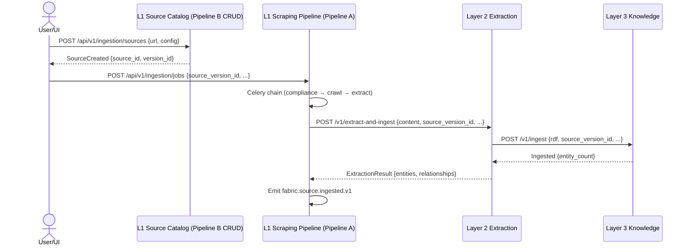

<!-- ADR-041: Canonical Layer 1 Ingestion Path -->

# ADR-041: Canonical Layer 1 Ingestion Path

**Status:** Accepted
**Date:** 2026-07-29
**Deciders:** Platform Engineering, Ingestion Engineering
**Reviewers:** Platform Architecture Committee

---

## Context

Layer 1 (`services/layer1-ingestion/`) currently contains **two distinct orchestration models** for source acquisition:

### Pipeline A: Legacy Scraping Job Pipeline (Celery-based)
**Location:** `services/layer1-ingestion/src/layer1_ingestion/shared/tasks.py`
- **Stages:** COMPLIANCE_CHECK → BROWSER_LAUNCH → NAVIGATION → CONTENT_CAPTURE → AI_EXTRACTION → POST_PROCESSING → VALIDATION → STORAGE → NOTIFICATION
- **Execution:** Celery task chain with idempotent stage persistence
- **L2 Integration:** Calls `POST {LAYER2_URL}/v1/extract` (extraction-only) or dispatches Celery task `layer2_extraction.shared.tasks.run_extraction_task`
- **Provenance:** 2+ years in production; handles compliance, robots.txt, smart routing (FAST/FAST_WITH_FALLBACK/BROWSER), quality gates, PII scanning
- **State:** `ScrapingJob` with `PipelineStage` enum (11 stages), `JobStatus` enum, stage details in `JobStageDetail`
- **Metrics:** Prometheus metrics per stage, crawl path distribution, queue latency

### Pipeline B: Unified Source Intake Pipeline (Coordinator-based)
**Location:** `services/layer1-ingestion/src/layer1_ingestion/orchestrator/`
- **API:** `source_routes.py` — `POST /api/v1/ingestion/sources`, `POST /api/v1/ingestion/sources/{id}/versions`, `POST /api/v1/ingestion/runs`
- **Orchestrator:** `coordinator.py` — creates `IngestionRun`, inserts outbox event `fabric.source.normalized.v1`, invokes stage handlers
- **Stage Handlers:** `stage_handlers/__init__.py` registry
  - **Implemented:** VALIDATING_ACCESS, RESOLVING_CONNECTOR, FETCHING_SOURCE, APPLYING_POLICY
  - **NOOP (6 stages):** NORMALIZING, CHUNKING, EXTRACTING, BUILDING_CLAIMS, VALIDATING_CLAIMS, PROJECTING_SUMMARY
  - **Terminal NOOP:** NEEDS_USER_ACTION, FAILED_RETRYABLE
- **Outbox Relay:** `outbox_relay.py` polls `EventOutbox` for `stage_name IS NOT NULL` — but `fabric.source.normalized.v1` is inserted **without** a stage name, so relay never picks it up
- **Models:** `IngestionRun`, `IngestionRunStatus`, `Source`, `SourceVersion`, `NormalizedDocument`, `EventOutbox`

---

## Problem Statement

| Concern | Pipeline A (Legacy) | Pipeline B (Unified) |
|---------|---------------------|----------------------|
| **L2→L3 Graph Population** | Calls `/v1/extract` (no ingest) → **NO graph population** | No consumer for outbox → **NO downstream processing** |
| **Downstream Integration** | Extraction only; L2 Celery task also calls extract function directly | Stage handlers are NOOP; no L2/L3/L4/L5/L6 integration |
| **Event-Driven Architecture** | None — synchronous Celery chain | Outbox event created but never consumed |
| **Production Readiness** | ✅ Battle-tested, metrics, compliance, quality gates | ❌ 6/10 stages NOOP; outbox relay broken by design |
| **Schema Evolution** | Ad-hoc `job.configuration` JSON | Pydantic models but no consumers |
| **Tenant Isolation** | ✅ `get_db_session(tenant_id=...)` in every stage | ✅ Coordinator passes tenant_id |

**The repository has no working end-to-end ingestion path from source → L2 extraction → L3 graph → L4/L5/L6.**

---

## Decision

### 1. Canonical Pipeline: Pipeline A (Legacy) — Enhanced

**Pipeline A is the canonical ingestion path.** It is production-hardened, has real L2 integration, and can be extended to call `/v1/extract-and-ingest` for graph population.

**Pipeline B is deprecated for production ingestion.** Its source API (CRUD for sources/versions) is retained for **source catalog management only** — not for pipeline execution. The coordinator, stage handlers, and outbox relay are archived.

### 2. Required Enhancements to Pipeline A

| Enhancement | Description | Owner |
|-------------|-------------|-------|
| **Call `/v1/extract-and-ingest`** | Modify `ai_extraction_stage` to call L2 `/v1/extract-and-ingest` instead of `/v1/extract` when `job.configuration.graph_population = true` (default: true) | Ingestion Engineering |
| **Idempotent L2 Ingestion** | L2 `/v1/extract-and-ingest` already idempotent via `source_id` + `source_version_id`; pass `raw_content_id` as `source_version_id` | Ingestion + Extraction Engineering |
| **L3 Graph Verification** | Add post-extraction verification step: query L3 `/v1/query/entities?source_version_id={id}` to confirm entities persisted | Ingestion Engineering |
| **Event Emission** | Emit `fabric.source.ingested.v1` event (per ADR-019) with `source_id`, `source_version_id`, `entity_count`, `tenant_id` for downstream consumers | Ingestion Engineering |
| **Source Catalog Bridge** | Pipeline B's `Source`/`SourceVersion` models repurposed as **catalog metadata** for Pipeline A jobs (link `ScrapingJob.configuration.source_version_id`) | Ingestion Engineering |

### 3. Pipeline B Component Disposition

| Component | Disposition | Rationale |
|-----------|-------------|-----------|
| `source_routes.py` (CRUD) | **Retain** — Source catalog API for UI/agents to register sources before ingestion | Decouples source registration from pipeline execution |
| `Source`, `SourceVersion`, `NormalizedDocument` models | **Retain** — Catalog metadata, not pipeline state | Pipeline A jobs reference `source_version_id` |
| `coordinator.py` | **Archive** — No pipeline execution; replace with simple job dispatch API | Pipeline A uses Celery dispatch |
| `stage_handlers/` (NOOP stages) | **Archive** — Delete `noop.py` and NOOP registrations | No implementation; misleading completeness signal |
| `outbox_relay.py` | **Archive** — Replace with event emission from Pipeline A | Outbox pattern not needed for synchronous pipeline |
| `IngestionRun`, `IngestionRunStatus` | **Archive** — Pipeline A uses `ScrapingJob` + `PipelineStage` | Single source of truth for job state |

### 4. Source Registration → Ingestion Flow

---

## Alternatives Considered

### Make Pipeline B Canonical (Implement NOOP stages)
- **Pros:** Cleaner architecture; event-driven; matches declared architecture
- **Cons:** 6 stages × ~200 LOC each = ~1,200 LOC to implement; outbox relay redesign; L2/L3 integration from scratch; no production validation; delays convergence by 6-12 months
- **Why Rejected:** Pipeline A exists, works, and has 2+ years of production hardening. Building Pipeline B to parity is waste.

### Run Both Pipelines in Parallel
- **Pros:** Migration path; A/B testing
- **Cons:** Dual maintenance; confusion over which is canonical; resource waste; no clear sunset for Pipeline B
- **Why Rejected:** No benefit — Pipeline A with enhancements covers all Pipeline B use cases.

### Extract Pipeline A to Separate Service (Layer 7)
- **Pros:** ADR-022 pattern; independent scaling
- **Cons:** Pipeline A is tightly coupled to L2/L3/L4; extraction adds network latency; not on critical path for L4 decomposition
- **Why Rejected:** Premature. Revisit if ingestion scales independently.

---

## Consequences

### Positive
- **Single canonical path** — No ambiguity about which pipeline executes
- **Graph population works** — `/v1/extract-and-ingest` → L3 `/v1/ingest` is implemented and tested
- **Faster convergence** — Enhancements to Pipeline A are surgical (route change + verification step)
- **Source catalog retained** — UI/agents can register sources without triggering pipelines
- **Compliance preserved** — Robots.txt, PII, URL safety, quality gates all remain

### Negative
- **Pipeline B code archived** — Sunk cost on coordinator/stage handlers/outbox
- **Celery remains** — Not event-driven; but Celery chain is reliable and observable
- **Legacy models persist** — `ScrapingJob`, `PipelineStage`, `JobStageDetail` instead of unified `IngestionRun`

---

## Compliance and Migration

### Migration Owner
Ingestion Engineering

### Phased Plan

| Phase | Action | Target |
|-------|--------|--------|
| **0 (this ADR)** | Declare Pipeline A canonical; archive Pipeline B execution code | 2026-07-29 |
| **1** | Modify `ai_extraction_stage` to call `/v1/extract-and-ingest` with `graph_population=true` | 2026-08-05 |
| **2** | Add L3 verification step post-extraction; emit `fabric.source.ingested.v1` | 2026-08-12 |
| **3** | Wire source catalog: `SourceVersion` created → `ScrapingJob` references `source_version_id` | 2026-08-19 |
| **4** | Archive `coordinator.py`, `outbox_relay.py`, NOOP stage handlers | 2026-08-26 |
| **5** | Update golden-path test to use canonical path; verify L3 entities from source | 2026-09-02 |

### Enforcement Mechanism
- **CI:** `router_contract_gate` validates no routes mounted under `/api/v1/ingestion/runs` (coordinator endpoints)
- **Test:** `test_backend_integrated_golden_path` uses Pipeline A + L2 extract-and-ingest + L3 verification
- **Documentation:** `docs/architecture/system-overview.md` updated to show single ingestion path

### Rollback Strategy
- Pipeline B code preserved in git history
- Feature flag `USE_UNIFIED_SOURCE_INTAKE=false` (default) controls coordinator mount
- Can re-enable coordinator routes if Pipeline A enhancement blocked

---

## Related Decisions
- ADR-039: Canonical Public API Shape (gateway routes for source catalog)
- ADR-019: Replayability, Event Envelope (fabric.source.ingested.v1 schema)
- ADR-022: Layer 4 Internal Decomposition (extraction pattern precedent)
- `contracts/route-contracts.json` (L1 ownership: `/api/v1/ingestion*` → `layer1-ingestion`)

---

## Evidence Required to Transition to Accepted
- [x] ADR authored and reviewed
- [ ] Phase 1: `ai_extraction_stage` calls `/v1/extract-and-ingest` (PR merged)
- [ ] Phase 2: L3 verification step + event emission (PR merged)
- [ ] Phase 3: Source catalog bridge (PR merged)
- [ ] Phase 4: Pipeline B execution code archived (PR merged)
- [ ] Phase 5: Golden path test updated and passing in CI

---

**Last Updated:** 2026-07-29