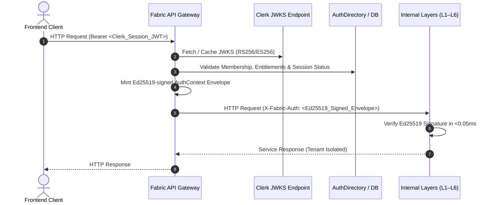

# ADR-043: Gateway Token Re-wrapping with Ed25519 Internal Envelopes

**Status:** Accepted
**Date:** 2026-08-20
**Deciders:** Platform Architecture Committee, Security & Identity Engineering
**Reviewers:** Layer 1–6 Service Leads, Infrastructure Team

---

## Context

Fabric 4L operates a distributed architecture across six specialized processing layers (L1 Ingestion, L2 Extraction, L3 Knowledge Graph, L4 Agents, L5 Ground Truth, L6 Benchmarks). As the platform transitioned to Clerk as its primary Identity Provider (IdP), an architectural decision was required regarding how authentication context and authorization claims should propagate from edge clients to internal microservices.

Two primary architectural alternatives were evaluated:
1. **Pass-Through Clerk JWTs**: Forwarding raw Clerk RS256/ES256 session JWTs across all internal service boundaries. Each microservice would independently fetch Clerk's remote JWKS, parse the JWT, and query the database for tenant permissions.
2. **Gateway Token Re-Wrapping (BFF / Envelope Pattern)**: The perimeter API Gateway verifies incoming Clerk session JWTs against Clerk's JWKS, enriches claims with authoritative tenant and account scope from `AuthDirectory`, and signs a compact, deterministic `AuthContext` envelope using a fast Ed25519 private key forwarded via `X-Fabric-Auth`.

---

## Decision

We adopt **Gateway Token Re-wrapping with Ed25519 Internal Envelopes (`AuthContext`)**.

### Key Invariants

1. **Zero External Dependencies Inside the Trust Boundary**: Downstream layers (L1–L6) never communicate with Clerk's public JWKS endpoints or external networks for authentication. They verify tokens purely using local Ed25519 public keys.
2. **Deterministic Cryptographic Verification**: Ed25519 signature verification executes in under 50 microseconds (0.05ms), eliminating remote network latency and external IdP rate-limit vulnerabilities on internal service meshes.
3. **Canonical Multi-Tenant Authority**: The Gateway injects verified `tenant_id`, `user_id`, `roles`, `entitlements`, and `account_id` into the envelope. Internal services set `SET LOCAL app.tenant_id` exclusively from this envelope, preventing client-spoofed headers or query-string escalation.
4. **Multi-Key ID (`kid`) Rotation**: The Gateway supports zero-downtime Ed25519 key rotation with active and staged key pairs.

---

## Consequences

### Positive
- **Performance**: Eliminates 10ms–150ms JWKS fetch overhead on internal RPCs.
- **Resilience**: Outages or network partitions between Fabric and Clerk do not disrupt existing inter-service communication.
- **Security Boundary**: Internal services fail closed if an unsigned or invalidly signed `X-Fabric-Auth` envelope is presented. Client attempts to pass `X-Fabric-Auth` directly are stripped at the Gateway.
- **Provider Agnosticism**: Internal microservices are completely decoupled from Clerk-specific claims schemas, allowing IdP evolution without refactoring L1–L6 services.

### Negative / Trade-offs
- The API Gateway is the critical trust boundary and must maintain high availability.
- Key rotation tooling must distribute public keys to all internal services before rotating the private signing key.
