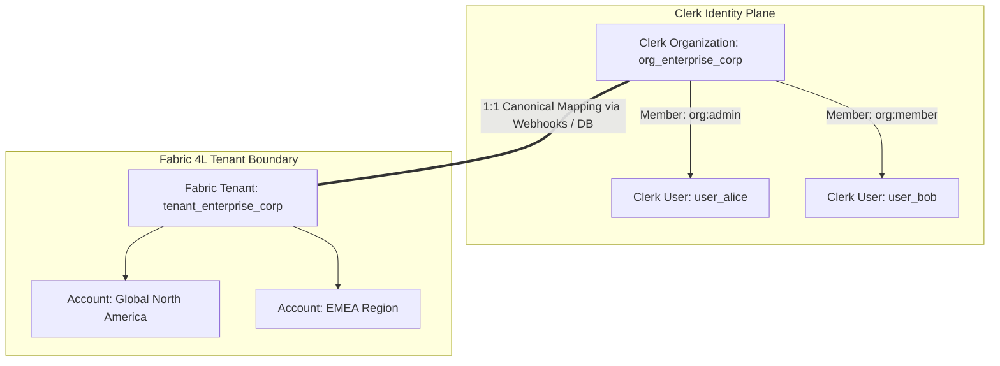

# ADR-044: 1:1 Mapping Between Clerk Organizations and Fabric Tenants

**Status:** Accepted
**Date:** 2026-08-20
**Deciders:** Platform Architecture Committee, Security & Identity Engineering
**Reviewers:** Product Management, Core Data Engineering

---

## Context

Fabric 4L is a multi-tenant B2B platform designed for enterprise value modeling and knowledge graph synthesis. The system requires a clean, predictable identity hierarchy for:
1. Multi-tenant data partitioning (PostgreSQL Row-Level Security, Neo4j Graph queries, Vector indices).
2. Enterprise SSO enforcement (SAML 2.0 / OIDC per corporate domain).
3. Subscription billing and license entitlement boundaries.
4. User membership and role assignment lifecycle.

With Clerk's native **Organizations** feature, we evaluated whether to map Clerk Organizations directly 1:1 to Fabric Tenants, or maintain an arbitrary N:M multi-organization-per-tenant abstraction layer.

---

## Decision

We establish a **strict 1:1 mapping between Clerk Organizations (`org_xxx`) and Fabric Tenants (`tenant_xxx`)**.

### Architectural Principles

1. **Identity vs. Authorization Boundary**:
   - Clerk Organizations own **identity aggregation, authentication policies, domain verification, and coarse roles (`org:admin`, `org:member`)**.
   - Fabric DB owns **fine-grained resource authorization, multi-account hierarchy, project assignments, and Row-Level Security (RLS)**.
2. **Deterministic Organization Slugs**:
   - Clerk organization `slug` and `id` map deterministically to Fabric `DirectoryTenant` and `tenant_registry` records.
3. **Webhook Synchronization as Eventual Consistency Engine**:
   - Events `organization.created`, `organization.updated`, `organization.deleted`, and `organizationMembership.*` synchronize state in near real-time via Svix-signed webhooks.
4. **Hierarchical Accounts within Tenants**:
   - Complex enterprise hierarchies (subsidiaries, regional divisions, brand units) are modeled inside Fabric as **Accounts (`account_id`)** within the single tenant, rather than nesting multiple distinct Clerk organizations.

---

## Consequences

### Positive
- **Simplicity**: Eliminates complex synchronization and token-remapping logic between multiple IdP organizations.
- **RLS Performance**: `SET LOCAL app.tenant_id = '<tenant_id>'` maps directly from the verified `org_id` in the Clerk session token.
- **Enterprise SSO Alignment**: SAML/OIDC domain matching (e.g. `@acme.com`) maps directly to a single tenant environment.
- **Billing Cohesion**: Clerk Billing and seat subscriptions bind naturally to the organization/tenant boundary.

### Negative / Trade-offs
- Customers with distinct business units sharing users across multiple isolated legal entities must switch active organizations in the UI (`<OrganizationSwitcher />`), prompting a fresh token issuance for the new tenant boundary.
