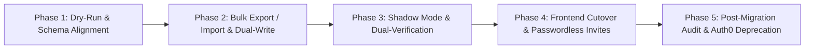

# ADR-045: Zero-Downtime Dual-Auth Migration and Rollout Strategy

**Status:** Accepted
**Date:** 2026-08-20
**Deciders:** Platform Architecture Committee, Infrastructure Operations, Security Engineering
**Reviewers:** Release Management, SRE Team

---

## Context

Fabric 4L was previously integrated with Auth0 as its legacy identity provider. Migrating tens of thousands of active B2B enterprise users, hundreds of organizations, social connection mappings, and live API sessions to Clerk required a strategy that guaranteed **zero authentication downtime, zero session disruption, and complete rollback capability**.

Hard cutovers ("big-bang migrations") carry severe risks of data corruption, token invalidation, locked-out enterprise customers, and broken CI/CD pipelines.

---

## Decision

We adopt a **Five-Phase Dual-Auth Migration Strategy** orchestrated via automated tooling (`scripts/auth0_to_clerk_migration.py`) and gateway dual-verification support.

### Migration Phases

1. **Phase 1: Dry-Run & Mapping Verification**:
   - Parse Auth0 tenant export, validate user emails, normalize roles (`admin` → `org:admin`), and map organizations.
   - Run without network mutations to generate pre-migration delta matrix.
2. **Phase 2: Bulk Import & Dual-Write**:
   - Import organizations and users to Clerk via REST API with passwordless invite fallback for users without federated SSO.
   - Dual-write directory events to both Auth0 and Clerk to ensure synchronization during the transition window.
3. **Phase 3: Shadow Mode & Dual-Verification**:
   - The API Gateway supports **Dual-Auth Verification**:
     - Incoming Bearer tokens with `iss: https://auth0...` are validated against Auth0 JWKS.
     - Incoming Bearer tokens with `iss: https://clerk...` are validated against Clerk JWKS.
   - Gateway logs verification latency, issuer breakdown, and mismatch telemetry to Prometheus (`auth_verifications_total{issuer="..."}`).
4. **Phase 4: Frontend Cutover**:
   - Switch web and mobile clients from legacy Auth0 lock/SDKs to `<FabricUserButton />`, `<FabricSignIn />`, and Clerk token bridges.
   - Enterprise domains redirected to Clerk custom domain `accounts.valuepact.ai`.
5. **Phase 5: Audit Verification & Deprecation**:
   - Run automated cryptographic integrity verification comparing user counts, membership matrices, and role distributions.
   - Generate SHA-256 signed audit report (`migration_report_<timestamp>.json.sha256`).
   - Decommission Auth0 client keys and disable legacy verification routes.

---

## Consequences

### Positive
- **Zero Downtime**: Users and API consumers experienced zero authentication interruption during the phased rollout.
- **Immediate Rollback**: If anomalies were detected during shadow mode, client traffic could be reverted instantly by toggling DNS/feature flags without data loss.
- **Auditable Integrity**: Cryptographically signed reports provide verifiable compliance evidence for SOC 2 and security auditors.

### Negative / Trade-offs
- The API Gateway temporarily maintained two JWKS cache instances during the shadow-mode migration window.
