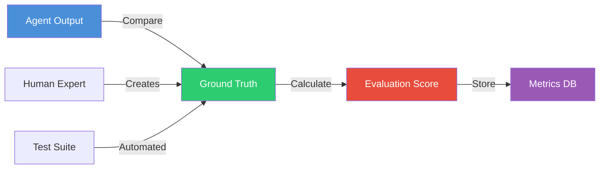

# Layer 5: Ground Truth & Evaluation API

> **Base URL:** `http://localhost:8005` (local) / `https://l5.valuefabric.io` (production)  
> **Base Path:** `/api/v1`  
> **Service:** Ground-truth store and evaluation API for validating agent outputs
>
> **Audit note (2026-07-18):** The current Layer 5 router (`services/layer5-ground-truth/src/layer5_ground_truth/api/router.py`) exposes `/api/v1/truths/*` and `/api/v1/maturity-ladder/*` only. The `/api/v1/evaluations` and `/api/v1/benchmarks` endpoints described below are not implemented in L5; benchmarking lives in `services/layer6-benchmarks/` and evaluation workflows are proxied through Layer 4.

---

## In this guide

- Create and manage ground truth records
- Run evaluations against agent outputs
- Track evaluation metrics over time
- Benchmark agent performance

---

## Architecture Context



---

## Authentication

```http
Authorization: Bearer <jwt_token>
X-Tenant-ID: <tenant_uuid>
```

---

## Endpoints Overview

| Method | Path | Description | Auth |
|--------|------|-------------|------|
| GET | `/api/v1/truths` | List ground truth records | Yes |
| POST | `/api/v1/truths` | Create ground truth | Yes |
| GET | `/api/v1/truths/{id}` | Get truth record | Yes |
| PUT | `/api/v1/truths/{id}` | Update truth | Yes |
| DELETE | `/api/v1/truths/{id}` | Delete truth | Yes |
| POST | `/api/v1/evaluations` | Run evaluation | Yes |
| GET | `/api/v1/evaluations/{id}` | Get evaluation result | Yes |
| GET | `/api/v1/benchmarks` | List benchmarks | Yes |
| GET | `/api/v1/academy/pillars` | List academy pillars | Yes |
| GET | `/api/v1/academy/pillars/{id}` | Get pillar detail | Yes |
| GET | `/api/v1/academy/pillars/{id}/quiz` | Get quiz questions | Yes |
| POST | `/api/v1/academy/quiz/submit` | Submit quiz answers | Yes |
| GET | `/api/v1/academy/progress` | Get user progress | Yes |
| PUT | `/api/v1/academy/progress` | Update progress | Yes |
| GET | `/api/v1/academy/certifications` | List certifications | Yes |
| GET | `/api/v1/academy/maturity/levels` | Maturity level definitions | Yes |
| POST | `/api/v1/academy/maturity/assessments` | Create assessment | Yes |
| GET | `/api/v1/academy/resources` | List resources | Yes |

---

## Ground Truth Records

### Create Ground Truth

```http
POST /api/v1/truths HTTP/1.1
Host: l5.valuefabric.io
Authorization: Bearer <token>
X-Tenant-ID: <tenant>
Content-Type: application/json

{
  "entity_id": "550e8400-e29b-41d4-a716-446655440000",
  "entity_type": "formula",
  "expected_value": {
    "result": 1250000,
    "currency": "USD",
    "breakdown": {
      "labor_savings": 1450000,
      "implementation_cost": -200000
    }
  },
  "source": "manual",
  "source_details": {
    "expert_name": "Jane Smith",
    "expert_title": "Senior Financial Analyst",
    "verification_date": "2025-01-01"
  },
  "notes": "Validated against actual customer implementation",
  "tags": ["roi", "manufacturing", "verified"]
}
```

**Source Types:**

| Source | Description | Trust Level |
|--------|-------------|-------------|
| `manual` | Human expert verification | Highest |
| `automated` | Automated test suite | High |
| `customer` | Customer-reported actual | Highest |
| `benchmark` | Industry benchmark | Medium |

**Response (201):**

```json
{
  "truth_id": "truth-660e8400-e29b-41d4-a716-446655440001",
  "entity_id": "550e8400-e29b-41d4-a716-446655440000",
  "entity_type": "formula",
  "status": "active",
  "created_at": "2025-01-01T00:00:00Z",
  "created_by": "user-123",
  "version": 1
}
```

### List Ground Truth Records

```http
GET /api/v1/truths?entity_type=formula&tags=verified&limit=20 HTTP/1.1
Host: l5.valuefabric.io
Authorization: Bearer <token>
X-Tenant-ID: <tenant>
```

**Response (200):**

```json
{
  "truths": [
    {
      "truth_id": "truth-660e8400-...",
      "entity_id": "550e8400-...",
      "entity_type": "formula",
      "source": "manual",
      "tags": ["roi", "verified"],
      "created_at": "2025-01-01T00:00:00Z"
    }
  ],
  "total": 150,
  "filter_counts": {
    "by_source": {
      "manual": 80,
      "automated": 50,
      "customer": 20
    }
  }
}
```

---

## Evaluations

### Run Evaluation

```http
POST /api/v1/evaluations HTTP/1.1
Host: l5.valuefabric.io
Authorization: Bearer <token>
X-Tenant-ID: <tenant>
Content-Type: application/json

{
  "evaluation_type": "accuracy",
  "agent_output_id": "output-770e8400-e29b-41d4-a716-446655440002",
  "truth_ids": ["truth-660e8400-e29b-41d4-a716-446655440001"],
  "options": {
    "tolerance_percentage": 5.0,
    "strict_mode": false,
    "compare_fields": ["result", "breakdown.labor_savings"]
  }
}
```

**Evaluation Types:**

| Type | Description | Use Case |
|------|-------------|----------|
| `accuracy` | Value comparison with tolerance | ROI calculations |
| `exact_match` | String/structure exact match | Entity extraction |
| `semantic` | Semantic similarity | Text generation |
| `composite` | Multiple criteria combined | Business cases |

**Response (200):**

```json
{
  "evaluation_id": "eval-880e8400-e29b-41d4-a716-446655440003",
  "evaluation_type": "accuracy",
  "agent_output_id": "output-770e8400-...",
  "score": 0.94,
  "passed": true,
  "threshold": 0.90,
  "details": {
    "comparisons": [
      {
        "field": "result",
        "expected": 1250000,
        "actual": 1200000,
        "difference_percentage": -4.0,
        "passed": true
      }
    ],
    "explanation": "Within 5% tolerance threshold"
  },
  "truth_references": [
    {
      "truth_id": "truth-660e8400-...",
      "entity_id": "550e8400-..."
    }
  ],
  "created_at": "2025-01-01T00:00:00Z"
}
```

### Get Evaluation Results

```http
GET /api/v1/evaluations/eval-880e8400-e29b-41d4-a716-446655440003 HTTP/1.1
Host: l5.valuefabric.io
Authorization: Bearer <token>
X-Tenant-ID: <tenant>
```

---

## Benchmarks

### List Benchmarks

```http
GET /api/v1/benchmarks?status=active HTTP/1.1
Host: l5.valuefabric.io
Authorization: Bearer <token>
X-Tenant-ID: <tenant>
```

**Response (200):**

```json
{
  "benchmarks": [
    {
      "benchmark_id": "bench-990e8400-...",
      "name": "ROI Calculator v2.1",
      "description": "Standard test suite for ROI calculations",
      "version": "2.1.0",
      "test_cases": 50,
      "passing_threshold": 0.90,
      "status": "active",
      "last_run": "2025-01-01T00:00:00Z",
      "average_score": 0.94
    }
  ]
}
```

### Run Benchmark

```http
POST /api/v1/benchmarks/bench-990e8400-.../run HTTP/1.1
Host: l5.valuefabric.io
Authorization: Bearer <token>
X-Tenant-ID: <tenant>
Content-Type: application/json

{
  "agent_version": "v2.3.1",
  "options": {
    "parallel": true,
    "max_concurrency": 5
  }
}
```

---

## Metrics Dashboard

### Get Evaluation Metrics

```http
GET /api/v1/metrics/evaluations?time_range=30d&group_by=agent_version HTTP/1.1
Host: l5.valuefabric.io
Authorization: Bearer <token>
X-Tenant-ID: <tenant>
```

**Response (200):**

```json
{
  "time_range": "30d",
  "metrics": {
    "total_evaluations": 1250,
    "pass_rate": 0.92,
    "average_score": 0.89,
    "by_agent_version": {
      "v2.3.0": {"count": 500, "pass_rate": 0.90, "avg_score": 0.87},
      "v2.3.1": {"count": 750, "pass_rate": 0.94, "avg_score": 0.91}
    },
    "trend": {
      "direction": "improving",
      "change_percentage": 4.5
    }
  }
}
```

---

## Academy

The Academy module provides the Value Operating System (VOS) training program through 10 structured pillars, quizzes, progress tracking, certifications, and maturity assessments.

### List Pillars

```http
GET /api/v1/academy/pillars HTTP/1.1
Host: l5.valuefabric.io
Authorization: Bearer <token>
X-Tenant-ID: <tenant>
```

**Response (200):**

```json
{
  "items": [
    {
      "id": "pillar-uuid",
      "pillar_number": 1,
      "title": "Value Definitions",
      "description": "Learn to articulate value in customer-centric language",
      "target_maturity_level": 1,
      "duration": "30-45 minutes",
      "content": {
        "overview": "...",
        "learning_objectives": ["Define customer value", "Distinguish features from outcomes"],
        "key_takeaways": ["Value is measured in customer outcomes"],
        "resources": [{"title": "Value Lexicon Cheat Sheet", "url": "/resources/lexicon.pdf", "type": "pdf"}]
      }
    }
  ],
  "total": 10
}
```

### Get Quiz Questions

```http
GET /api/v1/academy/pillars/{pillar_id}/quiz HTTP/1.1
Host: l5.valuefabric.io
Authorization: Bearer <token>
X-Tenant-ID: <tenant>
```

**Response (200):**

```json
{
  "items": [
    {
      "id": "question-uuid",
      "question_number": 1,
      "question_type": "multiple_choice",
      "category": "Value Definitions",
      "question_text": "What is the primary difference between a feature and an outcome?",
      "options": [
        {"label": "A feature is what the product does; an outcome is what the customer achieves", "value": "A"}
      ],
      "points": 4
    }
  ],
  "total": 1
}
```

### Submit Quiz

```http
POST /api/v1/academy/quiz/submit HTTP/1.1
Host: l5.valuefabric.io
Authorization: Bearer <token>
X-Tenant-ID: <tenant>
Content-Type: application/json

{
  "pillar_id": "pillar-uuid",
  "answers": [
    {"question_id": "question-uuid", "selected_answer": "A"}
  ]
}
```

**Response (201):**

```json
{
  "id": "result-uuid",
  "score": 100,
  "passed": true,
  "feedback": {
    "overall": "Excellent work! You demonstrated strong understanding.",
    "strengths": ["Clear differentiation between features and outcomes"],
    "improvements": [],
    "next_steps": ["Proceed to Pillar 2: KPI Taxonomy"]
  },
  "attempt_number": 1
}
```

*Pass threshold: 80%. Passing automatically awards a certification and updates progress to "completed".*

### Get Progress

```http
GET /api/v1/academy/progress HTTP/1.1
Host: l5.valuefabric.io
Authorization: Bearer <token>
X-Tenant-ID: <tenant>
```

**Response (200):**

```json
{
  "items": [
    {"id": "progress-uuid", "pillar_id": "pillar-uuid", "status": "completed", "completion_percentage": 100}
  ],
  "overall_percentage": 10,
  "completed_count": 1,
  "total_count": 10
}
```

### Maturity Levels

```http
GET /api/v1/academy/maturity/levels HTTP/1.1
Host: l5.valuefabric.io
Authorization: Bearer <token>
X-Tenant-ID: <tenant>
```

**Response (200):**

```json
[
  {"level": 0, "name": "Unaware", "description": "No formal value selling practices", "behaviors": []},
  {"level": 1, "name": "Emerging", "description": "Basic value language adoption", "behaviors": ["Can articulate feature vs. outcome"]},
  {"level": 2, "name": "Developing", "description": "Structured value conversations", "behaviors": ["Uses KPI taxonomy", "Builds simple ROI"]},
  {"level": 3, "name": "Practicing", "description": "Consistent value-led selling", "behaviors": ["Tracks value realization", "Maps stakeholders"]},
  {"level": 4, "name": "Optimizing", "description": "Advanced value transformation", "behaviors": ["Executive communication", "Competitive differentiation"]},
  {"level": 5, "name": "Leading", "description": "Value-centered organization", "behaviors": ["Drives organizational change", "Coaches others"]}
]
```

---

## Error Handling

| Error Code | HTTP Status | Cause | Resolution |
|------------|-------------|-------|------------|
| `TRUTH_NOT_FOUND` | 404 | Invalid truth_id | Verify ID |
| `EVALUATION_FAILED` | 500 | Comparison error | Check data types |
| `INSUFFICIENT_TRUTH` | 422 | No truth for entity | Create ground truth |
| `BENCHMARK_NOT_FOUND` | 404 | Invalid benchmark_id | Verify ID |

---

## SDK Examples

### Python

```python
from value_fabric import Client

client = Client(api_key="vf_live_...", tenant_id="...")

# Create ground truth
truth = client.ground_truth.create(
    entity_id="formula-001",
    entity_type="formula",
    expected_value={"result": 1250000},
    source="manual",
    notes="Verified by finance team"
)

# Run evaluation
eval_result = client.evaluations.run(
    agent_output_id="output-001",
    truth_ids=[truth.truth_id],
    evaluation_type="accuracy",
    options={"tolerance_percentage": 5.0}
)

print(f"Score: {eval_result.score:.2f}, Passed: {eval_result.passed}")

# Get metrics over time
metrics = client.evaluations.get_metrics(time_range="30d")
print(f"Pass rate: {metrics.pass_rate:.1%}")
```

---

## Best Practices

### Ground Truth Creation

1. **Multiple Sources**: Combine manual + automated + customer data
2. **Version Control**: Update truth records when formulas change
3. **Tagging**: Use consistent tags for filtering
4. **Documentation**: Include verification details in notes

### Evaluation Strategy

1. **Tolerance Levels**: Set realistic thresholds (5-10% for ROI)
2. **Regular Benchmarks**: Run weekly against test suites
3. **Trend Monitoring**: Track scores over time
4. **Failure Analysis**: Investigate all failed evaluations

---

## Next Steps

- [Layer 4: Agents API](./layer4-agents-api.md) — Run agent workflows
- [Evaluation Framework](../core-concepts/evaluation-framework.md) — How evaluation works
- [Manage Ground Truth](../how-to-guides/manage-ground-truth.md) — Best practices

---

*Last updated: 2026-04-19 | [Edit this page](https://github.com/bmsull560/Fabric_4L/edit/main/docs/reference/layer5-ground-truth-api.md)*

## Canonical governance envelope on truth APIs

Layer 5 endpoints that surface AI-assembled claim summaries or governance decisions may return a canonical envelope around payload data, defined in `contracts/jsonschema/agent-response-envelope.json`.

Current endpoints where envelope fields can appear:
- `GET /api/v1/truths`
- `GET /api/v1/truths/{id}`
- `POST /api/v1/truths/{id}/validate`

Behavior:
- `claim_citations` and `evidence_provenance_ids` are returned when supporting evidence linkage exists.
- `policy_decision` and `approval_required` are set when governance policy evaluates the response/action.
- `refusal_reason` is returned when policy blocks disclosure/action (for example, out-of-scope tenant data).
- `tenant_scope` identifies evaluated tenant context and cross-tenant blocks.
