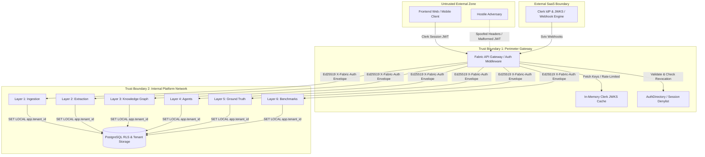

# Threat Model: Fabric 4L Authentication Plane & Internal Envelope

## 1. System Overview & Trust Boundaries

The Fabric 4L Authentication Plane uses a **BFF (Backend-For-Frontend) / Gateway Token Re-wrapping Architecture**. External clients authenticate against **Clerk** (the Identity Provider), obtaining short-lived Clerk Session JWTs. The **Fabric API Gateway** validates Clerk JWTs (via JWKS) and mints an **Ed25519-signed internal envelope (`AuthContext`)** forwarded via `X-Fabric-Auth` to internal services across Layers 1–6.

---

## 2. STRIDE Threat Analysis

| Threat Category | Target / Component | Specific Threat Scenario | Mitigation Strategy in Fabric 4L | Severity | Status |
|---|---|---|---|---|---|
| **Spoofing (S)** | API Gateway Auth | Attacker presents a self-signed or forged JWT signed with an untrusted key. | JWKS signature verification against strict Clerk URL with cryptographic pinning; verification of `azp` (Authorized Party) and issuer `iss`. | Critical | Mitigated |
| **Spoofing (S)** | Internal Envelope | Attacker injects fake `X-Fabric-Auth` header directly from client. | API Gateway strips incoming `X-Fabric-Auth` from client requests; downstream services strictly verify Ed25519 signature of `X-Fabric-Auth` using gateway public key. | Critical | Mitigated |
| **Spoofing (S)** | Webhook Endpoint | Attacker posts forged events to `/internal/webhooks/clerk` to elevate permissions or forge users. | Svix HMAC-SHA256 signature verification over `(id, timestamp, body)` with strict 5-minute timestamp window; non-bypassable rate limiting. | Critical | Mitigated |
| **Tampering (T)** | Tenant / Account Scope | Tenant A user manipulates `X-Account-ID` or URL parameters to access Tenant B datasets. | Account scope is validated against `AuthDirectory` projection; `app.tenant_id` is set strictly from verified `AuthContext` claim, never from request payload. Adversarial test suite verifies denial. | Critical | Mitigated |
| **Tampering (T)** | Clock Skew Manipulation | Adversary manipulates timestamps or exploits server clock drift to use expired tokens. | Hardened clock-skew leeway bounded to ±60s with proactive logging and alerting on skew anomalies. | Medium | Mitigated |
| **Repudiation (R)** | User & Admin Actions | Malicious actor denies performing destructive tenant or data mutations. | Every request logs structured audit events with `tenant_id`, `actor_id`, `trace_id`, `session_id`, and `envelope_kid`. Internal audit ledger is append-only. | High | Mitigated |
| **Information Disclosure (I)** | Secret Leakage | Clerk API keys, Ed25519 private keys, or webhook secrets leaked into logs, error messages, or repos. | Infisical secret management, pre-commit gitleaks, `ProductionSafetyValidator` fail-closed checks, no-secrets in error responses (generic 401/403). | Critical | Mitigated |
| **Information Disclosure (I)** | Cross-Tenant Data Leakage | Query or retrieval across L3 Knowledge Graph / GraphRAG exposes another tenant's entities. | PostgreSQL Row-Level Security (RLS) and Neo4j Cypher queries parameterized strictly with `tenant_id` from verified `AuthContext`. Hostile cross-tenant tests run in CI. | Critical | Mitigated |
| **Denial of Service (D)** | JWKS Exhaustion | Attacker floods gateway with random `kid` headers forcing continuous remote JWKS HTTP fetches. | In-memory JWKS cache with background TTL, rate-limiting on remote JWKS refresh (max 1 fetch per 10s per kid), and bounded cache size. Chaos tests verify JWKS outage fallback. | High | Mitigated |
| **Denial of Service (D)** | Webhook Flood / Replay | Attacker replays historical webhook payloads to overwhelm database directory sync. | Svix `svix-id` deduplication via in-memory/Redis idempotency tracker; IP-based rate limiting on webhook routes. | High | Mitigated |
| **Elevation of Privilege (E)** | Session Revocation Bypass | Terminated employee uses a valid token within its remaining 15-minute window after being deprovisioned. | Active session denylist and user status version checks in `AuthDirectory` checked on every gateway request. Force-logout propagates immediately. | High | Mitigated |
| **Elevation of Privilege (E)** | Dev Auth Bypass in Production | Developer auth bypass flags (`DEV_AUTH_BYPASS=true`) enabled in production environment. | `ProductionSafetyValidator` refuses service startup if any dev auth bypass flag is detected in production mode. Dedicated test `test:prod-auth-bypass` in CI. | Critical | Mitigated |

---

## 3. Trust Boundary Invariants

1. **Gateway Re-wrapping Invariant**: Downstream services (L1–L6) **never** trust or parse client-provided tokens directly. All internal communication requires a cryptographically verified `X-Fabric-Auth` envelope signed with an active Ed25519 private key.
2. **Tenant ID Non-Bypassability**: `AuthContext.tenant_id` is derived strictly from Clerk's cryptographically verified `org_id` claim mapped to the Fabric tenant registry. Request bodies, query params, or client headers are never authoritative for tenancy.
3. **Fail-Closed Verification**: If JWKS is unavailable and token `kid` is unknown, verification fails closed (HTTP 401). If tenant mapping is missing or membership is inactive, requests fail closed (HTTP 403).
4. **Zero-Trust Network Perimeter**: Internal webhook endpoints (`/internal/webhooks/*`) require both valid Svix signatures and network-level ingress restrictions.
